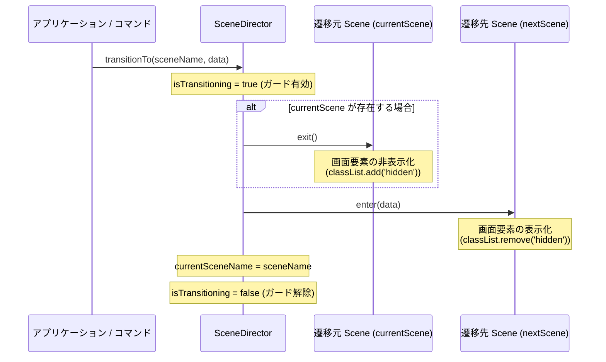
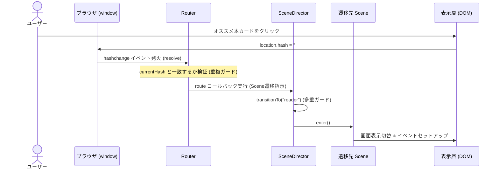

# [DSN-02] 詳細設計書 (Low-Level Design) - ゆうぞら (Yuzora)

本ドキュメントは、基本設計書（[DSN-01-high_level_design.md](/docs/DSN-01-high_level_design.md)）で定義された設計方針に基づき、青空文庫縦書きビューアー「ゆうぞら (Yuzora)」の内部設計およびアルゴリズム仕様（Low-Level Design）を定義します。

## 0. 設計の位置づけ (Design Alignment)
* **TOGAF EA との位置づけ**:
  本ドキュメント（詳細設計書）は、**TOGAF EA** の「データアーキテクチャ (DA)」および「テクノロジーアーキテクチャ (TA)」における**物理（実装）設計**を定義します。具体的な関数仕様、変数名、正規表現の置換仕様、ページ計算アルゴリズム、LocalStorageのJSONシリアライズスキーマ、CSS変数の実数値へのマッピングなどを物理レベルで規定します。
* **ADR (Architecture Decision Record) との連携**:
  パース処理の正規表現定義や、RTLにおけるスクロール位置補正計算式など、詳細設計・実装段階で発生した個別の技術的な意思決定や制約事項は、[docs/adr/](/docs/adr/) 内のADRに背景とともに記録されます。意思決定の起票・承認プロセスは、[MNG-08-adr_process.md](/docs/MNG-08-adr_process.md) に規定されるプロセスに従います。
* **設計ドキュメント間のすみ分け**:
  基本設計（HLD）や要件定義（SRD）との詳細な記述のすみ分け、およびオーバーラップした際のすみ分け・分掌については、[文書管理・ドキュメント台帳](/docs/MNG-01-document_ledger.md) に規定されている「設計ドキュメント間のすみ分けと分掌」に従います。

---

## 1. プログラム内部状態管理 (State Variables & Service Locator)

アプリケーションの動作状態やDOM要素の参照は、グローバル変数に直接保持するのではなく、**Service Locatorパターン**を用いて管理します。これにより、グローバルスコープの汚染を防ぎ、モジュール間の疎結合化とテスタビリティ（モック化の容易さ）を実現します。

### 1.1 サービスロケーター (`Locator` クラス)
[src/js/modules/locator.js](/src/js/modules/locator.js) に実装された `Locator` クラスは、依存解決のためのレジストリとして機能します。

- **`window.locator`**: `Locator` クラスのグローバルなシングルトンインスタンス。
- **主要メソッド**:
  - `register(Class, instance)`: 特定のクラスに対するオブジェクトインスタンスを登録します。
  - `resolve(Class)`: 登録されたクラスインスタンスを返します。未登録の場合はエラーをスローします。
  - `locate(Class)`: クラスを解決します。未登録の場合は自動的に引数のクラスから新規インスタンスを生成してキャッシュし、それを返します。

### 1.2 アプリケーションドメインモデルおよびコンテキスト設計

[src/js/modules/config.js](../src/js/modules/config.js) に定義された各ドメインクラスおよびコンテキストクラスは、アプリケーションのデータ、設定、表示状態、およびDOM要素への参照を関心事ごとに分離して管理します。起動時に各クラスのインスタンスはサービスロケーター（`Locator`）に登録され、他モジュールからはロケーター経由で直接解決されます。グローバル変数や `window` プロキシへのアクセスは完全に排除されています。

#### 1.2.1 `ViewContext`（表示・UIコンテキスト）
一時的なUI状態やレイアウト制御値、および初期化されたすべてのDOM要素参照を保持します。
- **プロパティ**:
  - `headerTimeout` (`number | null`): ヘッダーの自動非表示タイマーID。
  - `isReflowing` (`boolean`): レイアウト再計算（リフロー）中フラグ。
  - `activeHeadingId` (`string | null`): 現在表示中の目次項目ID。
  - `tocObserver` (`IntersectionObserver | null`): 目次スクロール監視用のIntersectionObserver。
  - `settingsDrawerOpen` / `tocDrawerOpen` (`boolean`): 各種引き出しメニューの開閉状態。
  - その他すべてのDOM要素（`app`, `welcomeScreen`, `readerScreen`, `readerViewport`, `readerContent` 等）への参照。

#### 1.2.2 `BookModel`（書籍データモデル）
現在読み込んでいる書籍ファイルのメタデータ、テキスト/HTML本文、および目次情報を管理します。
- **プロパティ**:
  - `title` (`string`): 書籍名。
  - `author` (`string`): 著者名。
  - `content` (`string`): 読み込んだ生テキストまたはHTMLデータ。
  - `type` (`string`): ファイルタイプ (`"txt"` | `"html"`)。
  - `totalPages` (`number`): 総ページ数。
  - `currentPage` (`number`): 現在の表示ページ位置。
  - `toc` (`Array`): 抽出された見出し・目次のリスト。
- **メソッド**:
  - `isEmpty()`: 書籍がロードされていない場合は `true` を返します。
  - `clear()`: 書籍データを初期化します。

#### 1.2.3 `ConfigModel`（表示設定モデル）
ユーザー設定（テーマ、フォント、文字サイズ、行間等）を保持し、永続化（LocalStorageへの保存・読込）およびスタイル適用を実行します。
- **プロパティ**:
  - `theme` (`string`): 現在の配色テーマ (`"sepia"` | `"light"` | `"dark"` | `"black"`)。
  - `font` (`string`): 適用中書体 (`"font-mincho"` | `"font-gothic"`)。
  - `direction` (`string`): 文字方向 (`"rtl"` | `"ltr"`)。
  - `size` (`string`): 文字サイズ (`"size-sm"` | `"size-md"` | `"size-lg"` | `"size-xl"`)。
  - `lh` (`string`): 行間設定。
  - `spacing` (`string`): 文字間設定。
- **メソッド**:
  - `load()`: LocalStorageから設定データを読み込みます。
  - `save()`: 現在の設定データをLocalStorageへ保存します.
  - `apply()`: 現在の設定内容をDOMツリー全体（`document.body`、フォントクラス等）に適用します。

#### 1.2.4 `BookmarkModel`（しおり・進捗管理モデル）
書籍ごとの読書進行状況を保持・永続化します。
- **プロパティ**:
  - `bookmarkProgress` (`number`): 現在の閲覧進捗率（`0.0` 〜 `1.0`）。
- **メソッド**:
  - `save(fileName, progress)`: 指定した書籍の進捗を永続化保存します。
  - `load(fileName)`: 指定した書籍の進捗を復元して返します。
  - `clear()`: 保存されたしおりデータをすべて削除します。

#### 1.2.5 `Scene` (画面シーン基底クラス)
画面状態の進入・脱出におけるライフサイクルイベントをカプセル化する抽象基底クラスです。
- **メソッド**:
  - `enter(data)`: シーン進入時（DOM表示化やリスナーのアタッチ等）の処理を行います。
  - `exit()`: シーン脱出時（DOM非表示化やリスナーのデタッチ等）の処理を行います。

#### 1.2.6 `SceneDirector` (画面遷移ディレクター)
共通フレームワーク（`src/js/frameworks/scene.js`）に定義され、アプリケーションの画面状態（シーン）遷移を一元管理します。
- **プロパティ**:
  - `scenes` (`Object<string, !Scene>`): 登録されている `Scene` インスタンスのマップ（初期値は空）。
  - `currentSceneName` (`string | null`): 現在アクティブなシーンの名前。
  - `isTransitioning` (`boolean`): シーン遷移中の多重呼び出しを防止するガードフラグ。
- **メソッド**:
  - `register(sceneName, sceneInstance)`: 動的に具象シーンインスタンスを登録します。
  - `transitionTo(sceneName, data)`: `currentScene.exit()` -> `nextScene.enter(data)` の順序でライフサイクルメソッドを実行し、遷移を完了させます。

#### 1.2.7 `Router` (ハッシュルーティングマネージャー)
共通フレームワーク（`src/js/frameworks/router.js`）に定義され、URLハッシュ（ハッシュルーティング）を用いた画面遷移および状態の解決を担当します。
- **プロパティ**:
  - `defaultRoute` (`string`): ハッシュパスが空の場合のフォールバック先ルートパス（例: `"welcome"`）。
  - `routes` (`Array<{pattern: !RegExp, callback: !Function}>`): 登録されているルートパターンのリスト。
  - `currentHash` (`string | null`): 現在アクティブなURLハッシュ値。初期値は `null`。
- **メソッド**:
  - `register(pattern, callback)`: ルートパスパターンを登録します（正規表現に内部変換）。
  - `resolve(hash)`: ハッシュ値を解析し、合致するルートコールバックを実行します（`currentHash` 重複防止ガードおよび空値時の `defaultRoute` フォールバック付き）。
  - `listen()`: `hashchange` イベントの監視および初期ロード時のハッシュパースを開始します。初期ロード時にハッシュ値が空の場合、自動的に `defaultRoute` へのリダイレクト（アドレスバー補完）を行います。
  - `navigate(hash)`: アプリ内部からハッシュ値を強制更新して画面遷移をトリガーします。

#### 1.2.8 `Asset` （アセット基底クラス）
アプリケーションが読み込む様々なデータ（テキスト、画像、フォントなど）のエンティティと状態をカプセル化する基底クラスです。
- **プロパティ**:
  - `id` (`string`): アセットを一意に識別するID（ファイル名やURL等）。
  - `type` (`string`): アセットの種別（例: `"book"`, `"image"`）。
  - `status` (`string`): ロード状態（`"loading"`, `"ready"`, `"failed"`）。
  - `error` (`Error | null`): ロード失敗時のエラーオブジェクト。
- **メソッド**:
  - `dispose()`: 保持している大容量データを解放（`null`代入）し、ガベージコレクションを促します。

#### 1.2.9 `BookAsset` （書籍アセットクラス）
`Asset` を継承し、青空文庫テキストやHTML等の書籍リソースデータを不変アセットとして保持します。
- **プロパティ**:
  - `title` (`string`): 書籍のタイトル。
  - `content` (`string`): デコード済みの生テキストまたはHTML文字列。
  - `toc` (`Array`): 抽出された目次・見出し情報リスト。

#### 1.2.10 `ResourceDirector` （リソースマネージャクラス）
アプリケーションで使用するすべてのアセットのロード、キャッシュ（保持）、およびアンロード（廃棄）を一元管理します。
- **プロパティ**:
  - `assets` (`Map<string, !Asset>`): ロードされたアセットのキャッシュマップ。
- **メソッド**:
  - `loadBook(id, source, loaderFn)`: `loaderFn` (非同期) を用いて書籍をロードします。同一IDのアセットが既に `ready` または `loading` の場合はキャッシュを返します。
  - `unload(id)`: 指定IDのアセットをアンロードし、`dispose()` を呼び出してキャッシュから削除します。
  - `clear()`: すべてのアセットをアンロードします。

#### 1.2.11 `RendererInterface` （レンダラーインターフェース）
ビューポートへのコンテンツ描画およびレイアウトの操作を行う表示層の共通インターフェースです。
- **メソッド**:
  - `render(htmlContent)`: パースされたコンテンツをDOMに描画します。
  - `restoreScrollPosition(progress, smooth)`: 読書進捗率に応じてビューポートのスクロール座標を設定します。
  - `scrollToPage(pageNumber)`: 指定ページへスムーズスクロールします（完了時に解決するPromiseを返します）。
  - `handleResize(progress)`: リサイズ時にレイアウト幅を調整してスクロール座標を再計算します（完了時に解決するPromiseを返します）。
  - `adjustPageBreaksForOverrun()`: カラム・ページ境界線をまたぐ（見切れる）文字のある段落の直前に動的改ページ `<div class="page-break dynamic-page-break"></div>` を挿入して自動でレイアウトを自己修復します。
  - `hasOverrunNearCurrentPage()`: 現在のスクロール位置に隣接するページ境界（左辺・右辺）をまたぐ文字があるかをDOM非変更の読み取り専用で検査します。文字レベル確認により偽陽性を除外し、真の overrun が存在する場合のみ `true` を返します。ページ移動後に不要なレイアウト再計算を回避するための軽量ガードとして使用します。

#### 1.2.12 `VerticalRenderer` （縦書き用レンダラークラス）
`RendererInterface` を実装し、縦書き表示およびマルチカラムレイアウトの描画・座標制御をカプセル化する具象クラスです。
- **プロパティ**:
  - `lastRepairMetrics` (`!Object`): 直近のレイアウト自己修復処理で収集された統計メトリクス。以下の構造を持ちます。
    - `passesCount` (`number`): 補正パスの回数（1パス化のため常に 1）。
    - `insertedCount` (`number`): 挿入された動的改ページの個数。
    - `durationMs` (`number`): 自己修復処理の所要ミリ秒。
  - `paragraphBoundsCache` (`!Array<!Object>`): 各段落のドキュメント絶対座標（`docLeft`, `docRight`）を保持するメモリキャッシュ。リフロー発生を抑えてパフォーマンスを向上させます。
- **メソッド**:
  - `cacheParagraphBounds()`: 全段落の絶対座標（`docLeft = rect.left + absScroll`, `docRight = rect.right + absScroll`）を計算し、`paragraphBoundsCache` を構築します。
- **セキュリティ要件 (Defense in Depth)**:
  - `render(htmlContent)` 実行時に、`DOMParser` を介して HTML をパースした上で、ホワイトリスト（タグ・属性制限）に基づくサニタイズ（`sanitizeDOM`）を強制します。
  - サニタイズ後、`innerHTML` による再評価を避けるため、DOMノードを直接移行（`appendChild`）して描画を完了させます。
- **レイアウト自己修復設計**:
  - `adjustPageBreaksForOverrun()` は、既存の `.dynamic-page-break` 要素を一旦クリアしたのち、段落ノードを前から順に1パス（1方向の走査）で走査し、境界またぎを検出して改ページを挿入します。改ページを挿入した段落は自動的に次のページに押し出されるため、再度その段落を評価しながら $O(N)$ の時間計算量で処理を完了します。修復の完了時には統計メトリクスを収集し、全段落の絶対座標（`docLeft`, `docRight`）を `paragraphBoundsCache` に構築した後、ドメインイベント `system:layout-repaired` を発行します。
- **絶対座標キャッシュによる境界診断の高速化**:
  - `hasOverrunNearCurrentPage()` は、スクロール動作中には変化しない各段落の絶対座標（`docLeft`, `docRight`）のキャッシュ（`paragraphBoundsCache`）を参照して現在ページの境界との交差判定を行います。これにより、ページめくり時の `getBoundingClientRect()` 呼び出しに伴う Layout Thrashing を完全に排除し、処理時間を 1ms 以下に短縮します。交差する段落が検出された場合のみ、ピンポイントで文字レベルのはみ出しチェックを実行します。
- **診断ロジックにおける第1ページ左端境界の除外ルール**:
  - RTL マルチカラムレイアウトでは、第1ページの段落が `viewport.left`（≈ 0px）より左に延伸することがあります（次のカラムへの自然な折り返し）。これはレイアウト上の正常な挙動であり、見切れ（overrun）ではありません。
  - `diagnoseBoundaryOverlap()` の左境界交差判定（`intersectsLeft`）では、`currentPage === 1` かつ `|scrollLeft| < 1px` の場合に `isFirstPageLeftEdge = true` とし、左境界またぎとして計上しない（false positive 除外）。
  - 一方、修復エンジン（`runOverrunCheckPass`）のページ境界は `k * clientWidth`（k=1, 2...）で計算されるため、第1ページ左端（X=0）はチェック対象外となる。診断の除外ルールはこの修復エンジンの動作範囲と整合した設計方針です。


### 1.3 依存注入・サービスロケーターへの登録クラス
起動時に各機能モジュールが Locator に登録され、他のモジュールからは Locator を通じて呼び出されます。今回、新たに `SceneDirector`、`Router`、`ResourceDirector` および `VerticalRenderer` が Locator に登録されます。


### 1.4 イベント駆動アーキテクチャ (Event Driven Architecture)
モジュール間の密結合を防ぎ、ビューアー制御（`viewer.js`）、UI制御（`ui.js`）、およびコマンド実行（`commands.js`）を疎結合に保つため、専用のカスタムイベントディスパッチャ（イベントバス）を導入しています。

#### 1.4.1 `YuzoraEvent` クラス
イベント発火時にメタデータを含めて伝播させるための専用イベントオブジェクトクラスです。
- **プロパティ**:
  - `type` (`string`): イベントの識別文字列名（例: `"book-loaded"`）。
  - `detail` (`*`): 任意のイベントペイロードデータオブジェクト。
  - `target` (`?Object`): イベントのディスパッチ元インスタンス参照。

#### 1.4.2 `YuzoraEventTarget` クラス
DOM Level 2 の `EventTarget` に準拠したカスタムイベントリスナーの登録・削除・配信機能を提供するクラスです。
- **メソッド**:
  - `addEventListener(type, listener)`: 特定イベントへのハンドラ登録。
  - `removeEventListener(type, listener)`: ハンドラの登録解除。
  - `dispatchEvent(event)`: 登録されているすべてのリスナーに対する非同期/同期的な通知処理の実行。

#### 1.4.3 サービスロケーターへの登録と疎結合の実現
`YuzoraEventTarget` はシングルトンとして `Locator` に登録され、システム全体で共有されます。
- `commands.js` はビューやビューアーの具象関数を直接呼び出す代わりに、`YuzoraEventTarget` 経由でイベント（`YuzoraEventType`）をディスパッチします。
- `viewer.js` や `ui.js` は `DOMContentLoaded` のタイミングでイベント登録を行い、イベント検知をトリガーに対応する処理を起動します。

#### 1.4.4 `YuzoraEventType` 定数 (Enum)
イベント名でのマジックストリング使用を排除し、型安全な通知を実現するため、以下のイベント種別定数を `event.js` に定義し、`window.YuzoraEventType` に公開しています。

| 定数キー名 | イベント識別子 (値) | ペイロード (`detail`) | 概要 |
| :--- | :--- | :--- | :--- |
| `BOOK_LOAD_START` | `'book-load-start'` | `{ fileName, source }` | 書籍ロード開始要求時 |
| `BOOK_LOADED` | `'book-loaded'` | `{ fileName, fileContent }` | 書籍のロードおよびデコード完了時 |
| `BOOK_RENDERED` | `'book-rendered'` | `null` | ビューポートへの流し込み描画完了時 |
| `BOOK_LOAD_FAILED` | `'book-load-failed'` | `{ fileName, error }` | ロード/パース時エラー発生時 |
| `NAVIGATE_PAGE` | `'navigate-page'` | `{ targetPage }` | 特定ページへの遷移要求時 |
| `PAGE_CHANGED` | `'page-changed'` | `{ currentPage, totalPages, bookmarkProgress }` | ページ位置変更・進行度更新時 |
| `CONFIG_CHANGED` | `'config-changed'` | `{ key, value, config }` | 表示設定（テーマ等）変更完了時 |
| `TOC_GENERATED` | `'toc-generated'` | `{ toc }` | 目次抽出・ツリー構造生成時 |
| `TOC_ACTIVE_CHANGED`| `'toc-active-changed'` | `{ activeHeadingId }` | アクティブ見出し変更時 |
| `TOGGLE_DEBUG_MODAL`| `'toggle-debug-modal'` | `{ open }` | デバッグモーダル表示切り替え要求時 |
| `TOGGLE_CONTROLS` | `'toggle-controls'` | `{ visible }` | メニューUI表示切り替え要求時 |
| `TOGGLE_DRAWER` | `'toggle-drawer'` | `{ drawerId, open }` | 設定/目次ドロワー開閉要求時 |
| `HISTORY_UPDATED` | `'history-updated'` | `{ history, canUndo, canRedo }` | コマンド履歴スタック更新時 |
| `DIAGNOSE_RUN` | `'diagnose-run'` | `{ timestamp }` | レイアウト座標診断実行要求時 |
| `DIAGNOSE_COMPLETED`| `'diagnose-completed'` | `{ report, issuesCount }` | 座標診断レポート生成完了時 |
| `LAYOUT_REPAIRED` | `'system:layout-repaired'` | `{ passesCount, insertedCount, durationMs }` | 自己修復レイアウトエンジンの実行完了時 |
| `LAYOUT_CHECK_REQUESTED` | `'system:layout-check-requested'` | `{ scope }` | レイアウトはみ出し検証の要求時 (`scope: 'current' \| 'all'`) |
| `LAYOUT_REPAIR_REQUESTED` | `'system:layout-repair-requested'` | `null` | レイアウト修復エンジンの実行要求時 |


### 1.5 画面遷移状態管理フレームワーク (Scene Transition Framework)

アプリケーション全体の画面遷移（ウェルカム画面 `#welcome-screen` と読書ビューアー画面 `#reader-screen`）の切り替え処理を `Scene` / `SceneDirector` によって一元制御し、疎結合かつ安全な遷移を実現します。

#### 1.5.1 画面遷移のライフサイクルシーケンス



#### 1.5.2 具体的なシーン定義とUIイベントライフサイクル

1. **`WelcomeScene`** (ウェルカム画面)
   - `enter(data)`: `#welcome-screen` の `.hidden` クラスを削除し、`#reader-screen` に `.hidden` クラスを追加します。また、`setupWelcomeEvents()` を呼び出して以下のイベント登録と初期描画を行います：
     - ドラッグ＆ドロップゾーン（`#drop-zone`）のドラッグイベント。
     - ファイル選択要素（`#file-input`）のファイル選択変更（`change`）イベント。
     - オススメ書籍（宮本武蔵等）のカードグリッドの動的構築と各カードのクリックイベント（ハッシュ書き換え）。
   - `exit()`: `#welcome-screen` に `.hidden` クラスを追加し、`cleanupWelcomeEvents()` を呼び出して、ウェルカム画面内で登録されていたすべてのイベントリスナー参照（`welcomeListeners` 配列管理）をデタッチします。

2. **`ReaderScene`** (読書画面)
   - `enter(data)`: `#reader-screen` の `.hidden` クラスを削除し、`#welcome-screen` に `.hidden` クラスを追加します。また、`setupReaderEvents()` を呼び出して以下のイベント登録を行います：
     - 読書ビューアー操作（`#reader-viewport`）のスクロールイベント。
     - ヘッダー・フッターの表示トグル・キーボードショートカットイベント。
     - 各種設定ドロワー・TOCドロワーの開閉および項目選択イベント。
     - 画面リサイズ監視（リフロー用オブザーバー）の設定。
   - `exit()`: `#reader-screen` に `.hidden` クラスを追加し、`cleanupReaderEvents()` を呼び出して、読書画面に関連するすべてのイベントハンドラー、キーボードリスナー、およびオブザーバー（`readerListeners` 配列管理）を漏れなくデタッチし、メモリ解放と状態クリーンアップを行います。

#### 1.5.3 ルーティングとシーン遷移の連携シーケンス (URL Hash & Scene Transition Flow)



---

## 2. ファイル解析・パースロジック (File Parsing & Conversion)

### 2.1 テキストファイルのパース (`parseAozoraText`)
Shift_JIS または UTF-8 から文字列へとデコードされたプレーンテキストは、以下のステップでHTMLへとパースされます。

1. **行分割**: テキストを改行コード（`\r\n` または `\n`）で配列に分割します。
2. **タイトル・著者名の自動抽出**: 配列の1行目をタイトル、2行目を著者名として抽出し、ヘッダーに適用します。
3. **メタデータ・ヘッダー情報のクレンジング**: 
   - `inHeader` フラグ（初期値: `true`）を用いて管理します。
   - ルール：`-------------------------------------------------------`（ダッシュ境界）または `［＃` で始まる開始指示（目次や始まり）を検知するまで、または一定行（5行以上）を超えてテキストが始まるまで、ヘッダー行として描画対象から除外します。
4. **メタデータ・フッター情報のクレンジング**: 
   - 行内に `底本：` または `青空文庫作成ファイル：` が検出された場合、それ以降の行は後書き・メタデータと判定し、ループ処理を即座にブレイクして除去します。
5. **見出し注記の検出・変換**: 
   - 各行のマークアップ置換の前に、`［＃「([^」]+)」は(大|中|小)見出し］` 注記を検索します。検出された場合、大見出しは `<h2>`、中見出しは `<h3>`、小見出しは `<h4>` へとマッピングします。行内から見出し注記テキストを除去したうえで、残りのテキスト（見出し内のルビなどを含む）にマークアップ置換を適用し、最終的に見出しタグで囲んで出力します。
6. **抽象構文木（AST）への変換および評価 (`formatAozoraMarkup`)**: 各行に対して新しく分離されたコンパイラコンポーネントクラス群（`AozoraTokenizer`, `AozoraParser`, `AozoraSemanticAnalyzer`, `AozoraEvaluator`）を順次実行し、セキュアな HTML 出力を組み立てます。

#### 新クラス設計と AST パイプライン仕様
* **AST ノード定義 (`ast-nodes.js`)**:
  - `ASTNode` 基底クラス：`type`（ノード種別）、`value`（テキスト等）、`rt`（ルビ仮名）、`children`（子ノード配列）をプロパティとして持つ。
  - 具象クラス：`RootNode`, `TextNode`, `RubyNode`, `BoldNode`, `ItalicNode`, `BoutenNode` を定義。
* **字句解析器 (`tokenizer.js` / `AozoraTokenizer`)**:
  - `tokenizeInline(text)` メソッド。行テキストをトークン（`TEXT`, `RUBY`, `BOLD_START/END`, `ITALIC_START/END`, `BOUTEN_START/END`）へ分割します。
  - **ルビの自動判定範囲規則**:
    `｜` または `|` による境界指定がない場合、漢字クラス（常用漢字以外に `々`, `仝`, `〆`, `〇`, `ヶ` および外字注記で表現する二の字点 `※［＃二の字点、面区点番号1-2-22］` などの繰り返し・特殊記号を含む）または単一のアルファベット単語を自動的に検出してルビ対象と判定します。境界指定 `｜` または `|` がある場合は、スペース（グループルビ）やカタカナ混じりなどを含む `《` までのすべての文字を範囲として抽出します。
* **構文解析器 (`parser.js` / `AozoraParser`)**:
  - `parseAozoraText(text)` メソッド。青空文庫テキストのパースを担当し、ASTのドキュメントルート（`DocumentNode`）を構築します。
  - **明示的な改ページ注記の直接解析**: 行が `［＃改ページ］`（前後トリミング後）に完全一致する場合、トークナイズやインラインのパースを介さず、直ちに `PageBreakNode` を直接 `documentChildren` 配列に追加して次の行に進む（`continue`）ブロック処理を行います。これにより、不要な段落要素（`<p>`）が生成されるのを防ぎます。
  - **見出し前の自動改ページと重複防止**: 見出し行（大見出し、中見出し）をパースする際、`documentChildren` を末尾から逆順走査して `EmptyLineNode`（空行）以外の直前の実質的なノード `prevNode` を取得します。`prevNode` が存在し、かつその `type` が `'Heading'`（大・中・小見出し全て）、`'PageBreak'`、`'CoverPage'` のいずれでもない場合に、見出しを処理する前に `new PageBreakNode()` を `documentChildren` に挿入します。これにより、表紙直後や見出し連続時、明示的改ページ直後の不要な二重改ページを防止します。小見出し（レベル4）については、自動改ページの対象外とします。
  - `parseTokensToAST(tokens)` メソッド。トークンストリームから木構造の `ASTNode` ツリーを構築します。
  - ネスト用スタック（`stack`）を管理し、太字や斜体、傍点の開始・終了トークンに基づいて入れ子関係を木構造として構築します。不整合な終了タグや閉じられていない状態が発生した場合でも、スタック規則により安全に元のテキストノードに戻すなどして整合性を維持します。
* **意味解析器 (`semantic-analyzer.js` / `AozoraSemanticAnalyzer`)**:
  - `analyze(astRoot)` メソッド。パースによって構築された AST ノードの木構造を再帰的に走査し、意味規則の検証・補正を行います。
  - **意味規則1**: ルビ（`RubyNode`）の下位階層にさらに別の `Ruby` 注記が入れ子（ネスト）されてはならない。違反が検出された場合、内側の `Ruby` ノードをプレーンな `TextNode` に書き換え（平坦化）、警告を出力します。
* **評価器 (`evaluator.js` / `AozoraEvaluator`)**:
  - `evaluate(astRoot)` メソッド。構築した AST ノード階層を深さ優先探索（DFS）で巡回し、ホワイトリストに適合する HTML タグを生成します。
  - **エスケープ処理 (XSS対策 - T-E1防御)**: 評価器が `TextNode` および `RubyNode` のテキストを出力する際に、自動的に `escapeHTML(value)` を適用して文字実体参照にエスケープします。エスケープ処理が AST 評価の最下層にカプセル化されているため、不整合なタグ置換や文字の順序依存による HTML インジェクションのリスクを根本から防ぎます。
  - 評価器の出力マッピング：
    - `Root` -> 子ノードの HTML 結合
    - `Text` -> `escapeHTML(value)`
    - `Ruby` -> `<ruby>escape(value)<rt>escape(rt)</rt></ruby>`
    - `Bold` -> `<strong class="aozora-bold">DFS(children)</strong>`
    - `Italic` -> `<em class="aozora-italic">DFS(children)</em>`
    - `Bouten` -> `<span class="em-sesame">DFS(children)</span>`
  - **DOMサニタイゼーション (T-E2防御)**: `sanitizeDOM(rootElement)` メソッドを搭載し、XHTMLパース時や表示描画直前に適用されるホワイトリスト型サニタイズ（DOM操作ベース）を一元管理します。


- **配置指定（地付き・地寄せ・地から字上げ）**:
  - 行頭または行末に存在する配置指定は、インラインのパースに先立って `parseAlignment` 関数で検出・除去され、段落要素（`<p>`）のクラスとして統合出力されます。
    - **地付き**: `［＃地付き］` -> クラス名 `chitsuki`
    - **地寄せ**: `［＃地寄せ］` -> クラス名 `chiyose`
    - **地から○字上げ**: `［＃地から([０-９0-9]+)字上げ］` -> クラス名 `chitage-n` (全角数字は半角に変換)
- **制御文字の除去**:
  - 改ページ以外の不可視の不要な制御文字（Form FeedやBOM等）を除去します。
  - 正規表現: `/[\x00-\x08\x0B\x0C\x0E-\x1F\x7F]/g`
  - 置換後: `""` (空文字)
- **制御文字の除去**:
  改ページ以外の不可視の不要な制御文字（Form FeedやBOM等）を除去します。
  - 正規表現: `/[\x00-\x08\x0B\x0C\x0E-\x1F\x7F]/g`
  - 置換後: `""` (空文字)

### 2.2 HTML/XHTMLファイルのパース (`parseAozoraHTML`)
1. ブラウザ標準の `DOMParser` を生成し、文字列を `text/html` としてパースします。
2. `<title>` タグから作品タイトルを抽出します。
3. 本文部分（`.main_body` または `body`）を取得します。
4. HTML版青空文庫特有のフッター要素（文献情報 `.bibliographical_information` およびカードリンク `.card_link`）をDOM操作で明示的に `remove()` 処理します。
5. XSS対策（T-E2の緩和策）として、抽出した本文要素に対してホワイトリスト方式のHTMLサニタイズ処理（`sanitizeDOM`）を適用します。
   - **許可するHTMLタグ**: `div`, `span`, `p`, `h1`, `h2`, `h3`, `h4`, `h5`, `h6`, `a`, `ruby`, `rt`, `rp`, `br`, `img`, `b`, `i`, `strong`, `em`
   - **許可する属性**: `class`, `id`, `src`, `alt`, `href`
   - **サニタイズ規則**:
     - 許可されていないタグ（`script`, `style`, `iframe` 等）は、その中身（子ノード含む）ごとDOMから削除します。
     - それ以外の未知のタグは、タグ自体を取り除いて子ノードをその親に引き上げます（アンラップ）。
     - 許可されていない属性はすべて削除します。特にイベントハンドラ（`on` で始まる属性名）は無条件で削除します。
     - URL属性（`href`, `src`）の値が `javascript:`, `data:`, `vbscript:` で始まる場合、その属性自体を削除してXSS実行を防ぎます。


### 2.3 事前定義作品のマスターデータとロード仕様

* **マスターデータ構造**:
  事前定義作品（吉川英治「宮本武蔵」8作品、夏目漱石「こころ」、魯迅「故郷」）のメタデータを `config.js` 内にオブジェクト配列として定義します。
  ```javascript
  const PREDEFINED_BOOKS = [
    // 開発者のオススメ本
    { id: "kokoro", title: "こころ", shortTitle: "こころ", cardId: 773, path: "src/books/773_yoko.txt", category: "developer", author: "夏目漱石", meta: "夏目漱石" },
    { id: "gokyo", title: "故郷", shortTitle: "故郷", cardId: 42939, path: "src/books/42939_yoko.txt", category: "developer", author: "魯迅", meta: "魯迅" },

    // 読書家のオススメ本
    { id: "musashi_01", title: "宮本武蔵 01 序、はしがき", shortTitle: "序、はしがき", cardId: 52395, path: "src/books/52395_yoko.txt", category: "reader", author: "吉川英治", meta: "01" },
    { id: "musashi_02", title: "宮本武蔵 02 地の巻", shortTitle: "地の巻", cardId: 52396, path: "src/books/52396_yoko.txt", category: "reader", author: "吉川英治", meta: "02" },
    ...
  ];
  ```
* **データの取得アルゴリズム (`loadPredefinedBook(book)`)**:
  1. ユーザーがウェルカム画面で作品を選択した際、選択された `book` オブジェクトを引数として受け取ります。
  2. `path` をターゲットとして `fetch` API を用いて非同期でテキストデータを取得し、バイナリバッファから Shift_JIS （失敗時は UTF-8）でデコードします。
     ```javascript
     function loadPredefinedBook(book) {
         currentFileName = `${book.cardId}_yoko.txt`;
         currentFileType = 'txt';
         
         fetch(book.path)
             .then(res => {
                 if (!res.ok) throw new Error(`Fetch failed: ${res.statusText}`);
                 return res.arrayBuffer();
             })
             .then(arrayBuffer => {
                 let text = '';
                 try {
                     const decoder = new TextDecoder('shift-jis', { fatal: true });
                     text = decoder.decode(arrayBuffer);
                 } catch (err) {
                     console.warn("Shift_JIS decode failed, falling back to UTF-8", err);
                     const utf8Decoder = new TextDecoder('utf-8');
                     text = utf8Decoder.decode(arrayBuffer);
                 }
                 currentFileContent = text;
                 displayBook();
             })
             .catch(err => {
                 console.error(err);
                 alert(`作品の読み込みに失敗しました: ${err.message}`);
             });
     }
     ```

---

## 3. 縦書きマルチカラム・スクロール位置計算 (Pagination & Scroll Physics)

ゆうぞらは、CSSのマルチカラム（段組み）機能を利用して、右から左へと横スクロールする見開きビューアーを実現しています。

```
 +-------------------------------------------------------+
 | <---- [ページ送り方向 (RTL Scroll)]                   |
 |                                                       |
 | +-------------------+ +-------------------+  Viewport |
 | |                   | |                   |  (表示窓) |
 | |   2ページ目       | |   1ページ目       |           |
 | |   (左側カラム)     | |   (右側カラム)     |           |
 | |                   | |                   |           |
 | +-------------------+ +-------------------+           |
 +-------------------------------------------------------+
```

### 3.1 ページ計算式
- **全体の幅 (`scrollWidth`)**: 描画された本全体の横幅（隙間（ギャップ）を含む全ページ分の合計幅）。
- **表示領域幅 (`clientWidth`)**: 現在のブラウザに表示されている1画面（見開き）分の横幅。
- **最大スクロール幅 (`maxScroll`)**: 
  $$\text{maxScroll} = \text{scrollWidth} - \text{clientWidth}$$
- **現在の絶対スクロール位置 (`currentScroll`)**:
  RTL（Right-to-Left）書字方向において、`scrollLeft` は `0` (右端) から負の値 (左端に向かってマイナス) に減少します。LTR（Left-to-Right）書字方向においては、`scrollLeft` は `0` (左端) から正の値 (右端に向かってプラス) に増加します。絶対値を使用することで、双方の進行状況を共通の計算式で算出します。
  $$\text{currentScroll} = \left| \text{scrollLeft} \right|$$
- **読了進捗率 (`bookmarkProgress`)**:
  $$\text{bookmarkProgress} = \frac{\text{currentScroll}}{\text{maxScroll}} \quad (0.0 \le \text{bookmarkProgress} \le 1.0)$$
- **総ページ数 (`pageCount`)**:
  $$\text{pageCount} = \text{round}\left( \frac{\text{scrollWidth}}{\text{clientWidth}} \right)$$
- **現在ページ番号 (`currentPage`)**:
  $$\text{currentPage} = \text{round}\left( \frac{\text{currentScroll}}{\text{clientWidth}} \right) + 1$$
- **進捗バークリック・ドラッグ（スクラブ）位置からの進捗率算出**:
  マウスのドラッグ開始時（`mousedown`）またはタッチ操作の開始時（`touchstart`）に、ドラッグ状態フラグ `isDraggingProgress` を `true` に設定し、コンテナに `.dragging` クラスを付与してリアルタイムに進捗率を算出・スクロール位置へ即時反映します。
  進捗率の計算はページの送り方向（RTL/LTR）により逆転します。
  $$\text{bookmarkProgress} = \begin{cases} 1 - \frac{\text{clientX} - \text{rect.left}}{\text{rect.width}} & (\text{RTL時}) \\ \frac{\text{clientX} - \text{rect.left}}{\text{rect.width}} & (\text{LTR時}) \end{cases}$$
  ドラッグ終了（`mouseup` / `touchend`）時にフラグを `false` に戻し、変更された進捗率のしおりを永続化（`saveBookmark`）します。
- **指定ページジャンプからの進捗率算出**:
  $$\text{bookmarkProgress} = \frac{\text{targetPage} - 1}{\text{pageCount} - 1} \quad (\text{if pageCount} > 1)$$

### 3.2 ページ送り（ナビゲーション）
設定されている読書方向（`config.direction`）およびスワイプジェスチャー等の入力デバイスに応じて、画面タップエリア、キーボード矢印キー、スワイプ操作が連動します。

* **右から左（RTL）時のページめくり方向**:
  * **次ページ（左方向）**: $\text{scrollLeft} \leftarrow \text{scrollLeft} - \text{clientWidth}$ (左へスクロール)
  * **前ページ（右方向）**: $\text{scrollLeft} \leftarrow \text{scrollLeft} + \text{clientWidth}$ (右へスクロール)
* **左から右（LTR）時のページめくり方向**:
  * **次ページ（右方向）**: $\text{scrollLeft} \leftarrow \text{scrollLeft} + \text{clientWidth}$ (右へスクロール)
  * **前ページ（左方向）**: $\text{scrollLeft} \leftarrow \text{scrollLeft} - \text{clientWidth}$ (左へスクロール)
* **タッチスワイプ（1ページ送り制限）**:
  画面の横スクロール（慣性スクロール）をCSSで無効化（`overflow-x: hidden`）したうえで、`touchstart`、`touchmove`、`touchend` によるタッチ位置座標の変化（水平移動量 $\Delta x$ と垂直移動量 $\Delta y$）を用いてスワイプを検知します。
  * **RTL（右から左）設定時**:
    * **右スワイプ ($\Delta x > 50$ 且つ $\left|\Delta x\right| > \left|\Delta y\right|$)**: `nextPage()` を呼び出し、直後の1ページへ進む（左スクロール）。
    * **左スワイプ ($\Delta x < -50$ 且つ $\left|\Delta x\right| > \left|\Delta y\right|$)**: `prevPage()` を呼び出し、直前の1ページへ戻る（右スクロール）。
  * **LTR（左から右）設定時**:
    * **右スワイプ ($\Delta x > 50$ 且つ $\left|\Delta x\right| > \left|\Delta y\right|$)**: `prevPage()` を呼び出し、直前の1ページへ戻る（左スクロール）。
    * **左スワイプ ($\Delta x < -50$ 且つ $\left|\Delta x\right| > \left|\Delta y\right|$)**: `nextPage()` を呼び出し、直後の1ページへ進む（右スクロール）。

* **キーボード矢印キーおよびショートカット操作**:
  - **RTL設定時**: `ArrowLeft` で `nextPage()`、`ArrowRight` で `prevPage()`。
  - **LTR設定時**: `ArrowRight` で `nextPage()`、`ArrowLeft` で `prevPage()`。
  - **メニュー表示切替**: `ArrowUp` または `ArrowDown` 押下で `toggleControls()` を呼び出してヘッダー/フッター表示の On/Off を切り替え、キーイベントのデフォルト動作（ブラウザスクロール）を `preventDefault()` で無効化します。また、読書画面（`reader-viewport`）の本文タップ（クリック）操作時も `toggleControls()` を呼び出してトグル制御します（ただし、インタラクティブなリンク `a`、ルビ `ruby`、ボタン `button` クリック時は除外されます）。
  - **デバッグ機能操作 (PCのみ、テキスト入力中を除く)**:
    - **デバッグ画面開閉**: `d` または `D` でデバッグ画面の表示／非表示をトグル制御。
    - **デバッグ画面を閉じる**: `Escape` でデバッグ画面を非表示化。
    - **システム状態タブ選択**: `1` で `#tab-btn-monitor` のクリックイベントをトリガー。
    - **レイアウト診断タブ選択**: `2` で `#tab-btn-diagnose` のクリックイベントをトリガー。
    - **診断再実行**: `r` または `R` で `#btn-diagnose-layout` のクリックイベントをトリガー。
    - **診断レポートコピー**: `c` または `C` で `#btn-copy-debug-report` のクリックイベントをトリガー（無効化状態を除く）。

### 3.3 レイアウト変更時の位置復元とリフロー保護 (`isReflowing`)
リサイズやフォントサイズ、読書方向の変更時には、段組み寸法が変化して一時的に不規則なスクロールイベントが発生します。これを無視し元の位置を正確に維持するため、`isReflowing` 状態フラグで制御を行います。
1. 表示パラメータ変更前に `isReflowing = true` に設定。
2. スクロールイベントハンドラーは `isReflowing === true` の間、`bookmarkProgress` の上書きを行わない。
3. リフローの完了を待って（`setTimeout`）、以下の式でスクロール位置を復元したのち `isReflowing = false` に戻す。

$$\text{scrollLeft} \leftarrow \begin{cases} -(\text{bookmarkProgress} \times \text{maxScroll}) & (\text{RTL時}) \\ \text{bookmarkProgress} \times \text{maxScroll} & (\text{LTR時}) \end{cases}$$

### 3.4 パフォーマンス最適化とトレーシングログ設計
本アプリはクライアントサイドでのみ実行されるため、大規模な書籍データを扱う場合のレンダリング・スクロール性能とイベント駆動処理の安全な制御を確保するため、以下の設計を導入しています。

#### 3.4.1 レイアウト値のキャッシュによるレイアウトスラッシング（Layout Thrashing）の回避
スクロールイベントの発生ごとに `scrollWidth` や `clientWidth` などのレイアウトプロパティをDOMから動的に読み出し、直後に進行状況バー（`progressBar.style.width`）の更新等の書き込みを行うと、ブラウザの同期レイアウト再計算（レイアウトスラッシング）が多発します。
これを回避するため、`ViewContext` に `cachedScrollWidth` および `cachedClientWidth` を保持し、以下のタイミングでのみキャッシュを無効化（`null` 設定）してDOMから再取得します。
- 新規書籍の読み込み時（`displayBook()`）
- ウィンドウリサイズ時（`handleResize()`）
- 自己修復レイアウトエンジンの改ページ要素挿入/削除によるDOM構造変化時（`adjustPageBreaksForOverrun()`）

これら以外の通常のスクロール操作中は、キャッシュされた静的サイズ情報を参照して進捗パーセンテージやページ数を算出し、DOMへのプロパティ書き込み処理は `requestAnimationFrame` (rAF) により次の描画フレームまで遅延させ、単一フレーム内の重複実行を `cancelAnimationFrame` で抑制（スロットリング）します。

#### 3.4.2 多重スナップ（Magnetic Snap）の防止と完了検出
`snapScrollPosition()` によるスムーズスナップスクロール（`scrollTo({ behavior: "smooth" })`）の最中も、ブラウザは連続してスクロールイベントを発生させます。何も制御しない場合、それらのイベントによってさらに `scrollTimeout` が再スケジュールされ、多重に `snapScrollPosition()` が衝突してカクつきが発生します。
これを防ぐため、以下の排他状態制御を行います。
1. 磁気スナップが発動し `scrollTo` を呼び出す際、`viewContext.isSnapping = true` に設定。
2. スナップ中のスクロールイベントによって `onViewportScroll` 内でタイマーが再設定され続け、スナップスクロールのアニメーションが完了するとイベントの発火が止まります。
3. 静止から 150ms 後に `handleScrollDebounced` -> `snapScrollPosition()` が再び呼び出されます。この時点でターゲット位置との誤差が閾値（5px）以内であればスナップ完了と判定し、`isSnapping` を `false` にリセットします。
4. このスナップ完了の静止状態判定を契機として、`PAGE_CHANGED` イベントの発行、しおり保存（`saveBookmark`）、進行度更新を実行し、非同期の自己修復レイアウト判定（オーバーラン検証）をトリガーします。

#### 3.4.3 パフォーマンス・トレーシングログ (`__DEBUG_PERFORMANCE__`)
開発環境における処理速度測定とイベントループ追跡の透過性を確保するため、`window['__DEBUG_PERFORMANCE__']` グローバルデバッグフラグを設定可能にしています。有効時、以下の指標データがコンソールにリアルタイム出力されます。
- **ページ移動にかかった処理時間 (ms)**: コマンド起動からスクロール完了までの時間。
- **進行度更新処理のロジック実行時間 (ms)**
- **スクロール中のイベント発生統計**: スクロール開始から静止するまでに検知したスクロールイベントの総数（`scrollEventCount`）、経過時間、および秒間イベント発生頻度（events/sec）。これによりイベントの重複過剰発生やループ現象を検知できます。
- **レイアウト見切れ診断の実行時間 (ms)** と診断結果。
- **自己修復レイアウト調整の実行時間 (ms)**、イテレーションパス回数、および挿入された自動改ページ数。

---

## 4. LocalStorage データ保存仕様 (Storage Schema)

セッション復元やしおり機能のために、以下のスキーマでブラウザの LocalStorage を利用します。

### 4.1 UI設定 (`yuzora_config`)
- **キー名**: `yuzora_config`
- **値**: 設定オブジェクトのJSONシリアライズ文字列
- **スキーマ例**:
  ```json
  {
    "theme": "sepia",
    "font": "font-mincho",
    "direction": "rtl",
    "size": "size-md",
    "lh": "line-height-normal",
    "spacing": "spacing-normal"
  }
  ```

### 4.2 しおり進捗率 (`bookmark_<filename>`)
- **キー名**: `bookmark_${currentFileName}` （例: `bookmark_52395_yoko.txt`）
- **値**: 進捗率を示す文字列（実数値、例: `"0.4578"`)

### 4.3 セッション復元データ
再起動時に直前の状態に戻すため、以下のデータを保持します。
- `last_read_file_name` : 最後に読んだファイル名 (`string`)
- `last_read_file_type` : ファイルの拡張子形式 (`"txt"` または `"html"`)
- `last_read_file_content` : 最後にデコードされた状態のテキスト/HTML本文 (`string`)

---

## 5. CSS定義・スタイリング詳細 (CSS Variables & Styles)

テーマやカスタマイズ設定は、CSSのクラス切り替えとカスタムプロパティ（CSS変数）により実現されます。

### 5.1 テーマ変数マッピング ([style.css](/src/css/style.css))

| CSS変数名 | `:root` (和紙/Sepia) | `.theme-light` (明) | `.theme-dark` (暗) | `.theme-black` (漆黒) |
| :--- | :--- | :--- | :--- | :--- |
| `--bg-app` | `#f5eedc` | `#f8f9fa` | `#18181a` | `#000000` |
| `--bg-card` | `#fdfaf2` | `#ffffff` | `#222225` | `#121212` |
| `--bg-ui` | `rgba(253, 250, 242, 0.85)` | `rgba(255, 255, 255, 0.85)` | `rgba(34, 34, 37, 0.85)` | `rgba(18, 18, 18, 0.85)` |
| `--text-main` | `#2c221e` | `#1a1a1a` | `#e3e3e6` | `#b8b8b8` |
| `--text-muted` | `#705f55` | `#666666` | `#95959f` | `#6e6e6e` |
| `--border-color` | `rgba(112, 95, 85, 0.15)` | `rgba(0, 0, 0, 0.08)` | `rgba(255, 255, 255, 0.08)` | `rgba(255, 255, 255, 0.05)` |
| `--accent-color` | `#a67c52` | `#4f46e5` | `#818cf8` | `#a78bfa` |
| `--accent-hover` | `#8e623b` | `#4338ca` | `#6366f1` | `#8b5cf6` |
| `--ruby-color` | `#8c7667` | `#555555` | `#b0b0b8` | `#8a8a8a` |

### 5.2 フォントサイズ・間隔のクラスマッピング

#### 文字サイズ
- `.size-sm`: `font-size: 14.5px` (モバイル可読サイズ下限)
- `.size-md`: `font-size: 17px` (標準)
- `.size-lg`: `font-size: 21px` (大)
- `.size-xl`: `font-size: 25px` (特大)

#### 行間 (Line Height)
- `.line-height-tight`: `line-height: 1.7`
- `.line-height-normal`: `line-height: 2.1` (縦書きの推奨値)
- `.line-height-loose`: `line-height: 2.6`

#### 文字間 (Letter Spacing)
- `.spacing-tight`: `letter-spacing: 0.03em`
- `.spacing-normal`: `letter-spacing: 0.08em`
- `.spacing-loose`: `letter-spacing: 0.16em`

### 5.3 ルビと傍点のCSS詳細
- **ルビ (`rt`)**:
  - `font-size: 0.52em`
  - 縦書きのため、自動的に文字の右側に表示されます。
- **傍点 (`.bouten`)**:
  - `-webkit-text-emphasis: sesame` および `text-emphasis: sesame`。
  - カラーは現在の文字色（`var(--text-main)`等）に自動同期します。

### 5.4 モバイルレイアウト制限および垂直方向の上寄せ配置

#### モバイル制限 (画面幅767px以下)
* **Viewportマージンによる余白の静的確保**: 
  左右のパディング幅を狭めつつ十分な静的余白を確保するため、`--reader-padding-x` を 24px に設定します。
* **単一カラム幅制限と安全パディング**:
  スクロールコンテナである `.reader-viewport` が画面端から `var(--reader-padding-x)` 引き込んで配置されます。本流設計として、文字の左端の見切れ（ブラウザのスクロール限界でのコンテナパディング切り捨てバグ）を防ぎ、さらに `box-sizing: border-box` におけるカラムレイアウト計算のバグを防ぐため、安全パディング `--reader-viewport-padding-x`（モバイル: 24px、PC: 40px）を、境界線の外側の論理ブロックマージン `margin-block-start` および `margin-block-end` として単一 of コンテンツラッパー `.reader-content` 自身に適用します。コンテナ側は `padding: 0` にリセットします。
  ビューポート内の幅をそのまま占有するよう、カラム幅は `column-width: calc(100% - var(--reader-viewport-padding-x) * 2)` に指定し、複数カラムが左右に並んで表示されるのを完全に防ぎます。また、カラム間隙間（`column-gap`）には内部マージンの2倍を設定し、横スクロールによるページ送り幅と物理幅を完全に同期させます。
  ```css
  .reader-content {
      margin-block-start: var(--reader-viewport-padding-x);
      margin-block-end: var(--reader-viewport-padding-x);
      column-width: calc(100% - var(--reader-viewport-padding-x) * 2);
      column-gap: calc(var(--reader-viewport-padding-x) * 2);
  }
  ```

#### 垂直方向の上寄せ配置 (上寄せアライメント)
* **原因**: 縦書き表示時に `.reader-viewport` がフレックスコンテナ（`display: flex`）である場合、アラインメント制御（`align-items: flex-start` 等）を導入すると、ブラウザのフレックスボックス解釈により子要素 `.reader-content` の高さがコンテンツ最小バランス高（`height: auto` 相当）に縮小されてしまうバグが発生します。また、親要素に `padding` を設定して `height: 100%` を子要素に与えると、ブラウザがスクロールバーやパディングを誤って計算し、テキスト下部が画面外（ビューポート外）に押し端に描画される問題が生じます。
* **対策**: `.reader-viewport` からフレックスレイアウト（`display: flex`, `justify-content`, `align-items`）を完全に撤廃し、絶対配置レイアウトに変更します。さらに、ヘッダー/フッターを絶対配置のオーバーレイ形式とし、読書用コンテンツの上下余白をCSS変数（`--reader-padding-top`, `--reader-padding-bottom`）として定義します。コンテナ自体の `left` および `right` に `var(--reader-padding-x)` を適用して左右の静的余白を固定し、コンテナ内部の padding は `0` にリセットしたうえで、安全余白パディングは子要素 `.reader-content` 側で持たせます。
  ```css
  .reader-viewport {
      position: absolute;
      top: 0;
      bottom: 0;
      left: var(--reader-padding-x);
      right: var(--reader-padding-x);
      z-index: 1;
      padding: 0;
  }
  .reader-content {
      height: calc(100% - var(--reader-padding-top) - var(--reader-padding-bottom));
      margin-top: var(--reader-padding-top);
      margin-bottom: var(--reader-padding-bottom);
      margin-block-start: var(--reader-viewport-padding-x);
      margin-block-end: var(--reader-viewport-padding-x);
  }
  ```

### 5.5 縦書きテキストのインライン方向（上から下）の固定

* **原因**: ページめくりのスクロール初期表示位置を制御するため、親要素 `.reader-viewport` の CSS `direction` プロパティを `rtl` または `ltr` に動的に切り替えています。しかし、子要素 `.reader-content` および `.reader-section` が `direction` を継承しない（`direction: ltr` 等を固定する）場合、RTL 読書時に段組み（マルチカラム）の超過分が左側（スクロール可能領域）ではなく右側の画面外へ溢れてしまい、2ページ目以降が空白になるバグが発生します。一方、`direction` をそのまま継承させると、縦書き文字のインライン方向（テキストの流れる方向）が「下から上」に反転してしまい、アライメント崩れを誘発します。
* **対策**: 子要素 `.reader-content` および `.reader-section` は親要素の `direction`（`rtl` または `ltr`）を継承させて、段組みの並びと溢れの方向をスクロール方向と一致させます。その上で、縦書きテキストの文字の流れる方向を常に「上から下」に維持するため、セクションの直下の子要素群に対して一括で `direction: ltr;` を指定し、文字を物理的な「上揃え」で正しく描画させます。
  ```css
  .reader-section > * {
      direction: ltr; /* 縦書きテキストの流れ方向を常に「上から下」に固定 */
  }
  ```

### 5.6 読了後の余分な空白・空ページの排除

* **原因**:
  1. ファイル終端に多数の空行（bibliographical情報以前や段落間のパディングなど）が存在する場合、パーサー（`parseAozoraText`）がそれらをすべて空段落（`<p class="empty-line">&nbsp;</p>`）に変換してしまいます。縦書きマルチカラムでは、これらが余分な空白行としてレンダリングされ、最後のページ以降に連続する空ページを生じさせます。
  2. マルチカラム要素の幅が `width: auto` である場合、親スクロールコンテナとの関係から、ブラウザ（特に Chrome/Safari）がスクロール可能な最大幅（`scrollWidth`）を余剰に見積もってしまい、最後のページ以降にも無限にスクロールできてしまうレイアウト計算上のバグが発生します。また、縦書きマルチカラムと改ページ制御の組み合わせでは、`max-content` が最初の改ページ位置で計算を打ち切ってしまい、それ以降が非表示になる Chromium のバグがあります。
* **対策**:
  1. `parser.js` のテキストパーサー内において、パース完了後の配列 `parsedLines` の先頭および末尾から空段落を `shift()`/`pop()` により自動的に切り詰めます（トリミング処理）。
  2. 改ページをセクション分割によって解決した上で、`.reader-content` および `.reader-section` のスタイルに **`width: max-content;`** を適用します。これにより、マルチカラムおよびセクションコンテナの幅は生成された全カラム（ページ数）の合計幅に厳密に一致するように強制され、ブラウザによる余分なスクロール領域の自動算出を防ぎます。
  ```css
  .reader-content,
  .reader-section {
      width: max-content; /* 全カラムの合計幅にサイズを固定し、空スクロールを完全に抑止 */
  }
  ```

### 5.7 プログレスバーの左右反転とレイアウト方向制御

* **原因**: ページの送り方向（RTL / LTR）が切り替わった際、進捗状況を示すプログレスバーおよびつまみの動作・充填方向も動的に反転させる必要があります。これをビューアーコンテンツ（`.reader-content`）に適用されている `direction: rtl` 等と共通のクラスで行うと、前述のインライン方向や表示の潰れバグを誘発するため、影響範囲をレイアウト方向制御クラスとして分離する必要がありました。
* **対策**:
  1. `applySettings()` 関数内で、`document.body` に対して現在の読書方向に対応するクラス（`layout-direction-rtl` または `layout-direction-ltr`）を動的に追加します。
  2. CSSにて、これらのクラスを親セレクタとして、プログレスバーのフレックスコンテナの配置方向および絶対配置のつまみのオフセットを定義します。
  ```css
  /* RTL (右から左) の場合のプログレスバー・つまみの配置 */
  body.layout-direction-rtl .progress-bar-container {
      display: flex;
      justify-content: flex-end;
  }
  body.layout-direction-rtl .progress-thumb {
      left: -8px;
      right: auto;
  }

  /* LTR (左から右) の場合のプログレスバー・つまみの配置 */
  body.layout-direction-ltr .progress-bar-container {
      display: flex;
      justify-content: flex-start;
  }
  body.layout-direction-ltr .progress-thumb {
      right: -8px;
      left: auto;
  }
  ```

### 5.8 ページ境界での文章の左右見切れ・ページ分割防止対策

* **原因**: 
  1. 縦書きマルチカラムレイアウトにおいて、見出し（`h1`〜`h5`）の要素がカラム（ページ）の境界にまたがって分割される際、ブラウザのフォントレンダリングやパディング計算の差異によって、境界付近の文字の左右（または上下）が見切れる（欠ける）現象が発生します。なお、通常の段落（`<p>`）に改段防止（`break-inside: avoid`）を適用すると、1ページに収まらない長文段落が完全に画面外へ押し出されたり見切れたりする別の深刻なレイアウト崩れを引き起こすため、改段防止は短い見出し要素に限定する必要があります。
  2. 複数のマルチカラムコンテナを横並びに配置すると、ブラウザによる端数計算のズレが蓄積し、さらにスクロール限界（左端）でコンテナのパディングが切り捨てられるため、最後のページのテキストの左端（縦書きにおけるへん側）が見切れてしまいます。
* **対策**: 
  1. 読書画面内の見出し（`<h1>`〜`<h5>`）に対し、改段・改ページを防止する CSS プロパティ `break-inside: avoid` およびその互換用プロパティを適用します。通常の段落（`<p>`）は、各ページ間で自然に分割されるようにします。
  2. ドキュメント全体を単一のマルチカラムコンテナ（`.reader-content`）に格納し、改ページ（改段）位置には `<div class="page-break"></div>` を挿入します。Chromium等の縦書きマルチカラムにおける改ページCSS無視バグを回避するため、直前の要素の左端から次のカラム境界までの残り幅（`remainingWidth`）をJavaScript（`VerticalRenderer.applyPageBreakSizes()`）で動的に計算して `width` スタイルに適用し、物理的にカラムの残りスペースを埋め、さらに `margin-block-end` に `columnGap` を設定して後続の要素をカラムギャップの先から次のカラムへ安全に送り出すことで確実に改ページ（改カラム）制御を行います。
  3. スクロール限界でのパディング消失を防ぐ本流設計として、安全余白マージン（`margin-block-start/end: var(--reader-viewport-padding-x)`、モバイル: 24px、PC: 40px）をコンテナ自身に直接適用し、カラム幅（`column-width`）とカラム隙間（`column-gap`）を以下の数式に基づいて設定し、スクロール量と完全に同期させます。
     - モバイル時（画面幅767px以下）: `column-width: calc(100% - var(--reader-viewport-padding-x) * 2); column-gap: calc(var(--reader-viewport-padding-x) * 2);`
     - PC時（画面幅768px以上）: `column-width: calc(50% - var(--reader-viewport-padding-x) * 2); column-gap: calc(var(--reader-viewport-padding-x) * 2);`
  ```css
  /* 改段・改ページ制御（見出しごとに改ページし開始させ、見出し要素の境界分割を防止） */
  .reader-content h1,
  .reader-content h2,
  .reader-content h3,
  .reader-content h4,
  .reader-content h5 {
      break-before: column;
      -webkit-column-break-before: always;
      page-break-before: always;
      break-inside: avoid;
      -webkit-column-break-inside: avoid;
      page-break-inside: avoid;
  }

  /* 改ページ（改段）要素 */
  .page-break {
      display: block;
      height: 100%;
      width: 0; /* JavaScriptで動的に残り幅が設定される */
      visibility: hidden;
  }


  /* モバイル時：1カラムをビューポート幅に同期 */
  @media (max-width: 767px) {
      .reader-content {
          column-width: calc(100% - var(--reader-viewport-padding-x) * 2);
          column-gap: calc(var(--reader-viewport-padding-x) * 2);
      }
  }

  /* PC時：見開き2カラム（column-width + column-gap）をビューポート幅に同期 */
  @media (min-width: 768px) {
      .reader-content {
          column-width: calc(50% - var(--reader-viewport-padding-x) * 2);
          column-gap: calc(var(--reader-viewport-padding-x) * 2);
      }
  }
  ```

---

## 6. デバッグ機能設計仕様 (Debug Specifications)

デバッグ画面（デバッグモーダル）は、アプリケーションの実行状態を監視し、永続化されたストレージデータを段階的に初期化するための機能です。

### 6.1 アプリ内部状態モニター仕様

`updateDebugMonitor` 関数により、現在のアプリケーションの状態変数およびビューポートの物理寸法を収集し、JSON文字列として `#debug-monitor` 要素へ反映します。
デバッグ画面が表示されている間は、`setInterval` により **1000ms（1秒間隔）** で自動的にデータがリフレッシュされます。

#### 収集対象パラメータスキーマ
```json
{
  "build": {
    "id": "string (Git ショートハッシュ。ビルド時に <meta name=\"build-id\"> から読み取り / 未ビルド時は 'dev')",
    "date": "string (ビルド日時 UTC ISO8601形式。例: 2026-07-11T13:00:00Z / 未ビルド時は '---')"
  },
  "state": {
    "currentFileName": "string (読み込み中のファイル名 / 未ロード時は空文字)",
    "currentFileType": "string (txt | html | 空文字)",
    "bookmarkProgress": "string (進捗率のパーセンテージ表記。例: 45.2%)",
    "currentPage": "number (現在ページ番号。スクロール位置から算出)",
    "pageCount": "number (総ページ数。スクロール幅から算出)"
  },
  "viewport": {
    "clientWidth": "number (表示領域幅 px)",
    "clientHeight": "number (表示領域高 px)",
    "scrollWidth": "number (コンテンツ全体のスクロール幅 px)",
    "scrollLeft": "number (現在のスクロール量 px。RTL時はマイナス値)"
  },
  "config": {
    "theme": "string (テーマ名)",
    "font": "string (書体名)",
    "size": "string (文字サイズクラス)",
    "lh": "string (行間クラス)",
    "spacing": "string (文字間クラス)",
    "direction": "string (rtl | ltr)"
  },
  "localStorageKeys": [
    "string (現在 localStorage に保存されている全キーの配列)"
  ]
}
```

> **備考**: `build` フィールドの値は `index.html` の `<meta name="build-id">` / `<meta name="build-date">` から
> 読み取る（`commands.js::updateDebugMonitor()` の実装による）。`make` ビルドを経由していない
> 開発環境では `BUILD_ID_PLACEHOLDER` / `BUILD_DATE_PLACEHOLDER` のままとなるため、
> `content` 属性が空またはプレースホルダーの場合はフォールバック値（`dev` / `---`）を表示する。

### 6.2 localStorage 初期化仕様

ユーザーがデバッグボタンを押下した際、確認のダイアログ（`confirm`）を表示した後、それぞれ対象のデータ範囲に対して初期化を実行します。

| アクション名 | トリガー要素ID | 対象データ・キー | 挙動・後続処理 |
| :--- | :--- | :--- | :--- |
| **しおりデータ初期化** | `#btn-clear-bookmarks` | `last_read_file_name`<br>`last_read_file_type`<br>`last_read_file_content`<br>`bookmark_*` | 指定されたキーを `localStorage.removeItem()` で削除。しおりをクリア後、`window.location.reload()` でページをリロードする。 |
| **表示設定初期化** | `#btn-clear-config` | `yuzora_config`<br>`koizora_config` | 設定関連のキーを削除。表示設定を初期状態にリセット後、`window.location.reload()` でリロードする。 |
| **完全初期化** | `#btn-clear-all` | 全ての `localStorage` データ | `localStorage.clear()` を実行し、全データを完全削除。その後 `window.location.reload()` で初期起動状態に戻す。 |

### 6.3 レイアウト / 見切れ診断ロジック物理設計

#### A. 理想スクロールアライメントズレの算出式
理想のスクロール位置 $L_{ideal}$ は、現在のページ番号 $P_{current}$（1始まり）を元に、次式で算出されます。
$$L_{ideal} = \begin{cases} -((P_{current} - 1) \times W_{viewport}) & (\text{RTL時}) \\ (P_{current} - 1) \times W_{viewport} & (\text{LTR時}) \end{cases}$$
ここで $W_{viewport}$ はビューポートの幅（`readerViewport.clientWidth`）です。
実際のスクロール位置 $L_{actual}$ （`readerViewport.scrollLeft`）との差分（ズレ量 $D_{diff}$）は次式で計算され、$D_{diff} > 5\text{px}$ の場合に位置アライメント警告をレポートに出力します。
$$D_{diff} = \left| L_{actual} - L_{ideal} \right|$$

#### B. 境界線またぎ交差文字の検出ロジック (`findCharAtBoundary`)
現在表示されているページの左境界 $X_{left}$ および右境界 $X_{right}$ は、ビューポートの `getBoundingClientRect()` から得られます。
`reader-content` の子要素（段落等）の中で、要素の `rect = child.getBoundingClientRect()` が $rect.left < X_{left} < rect.right$ または $rect.left < X_{right} < rect.right$ を満たすものを「境界またぎ交差要素」として判定します。
交差している要素が検出された場合、以下の物理手順で正確な交差文字を特定します。
1. `document.createTreeWalker` を用い、要素内のすべてのテキストノード（`NodeFilter.SHOW_TEXT`）を走査・収集します。
2. 各テキストノードの各文字位置 $i$ について、`Range` オブジェクトを $i$ から $i+1$ の範囲で生成します。
3. `range.getBoundingClientRect()` から文字の物理矩形 $rect_{char}$ を取得します。
4. $rect_{char}.left \le X_{boundary} \le rect_{char}.right$ を満たす文字を「境界上の文字」として特定します。
5. またがっている文字が確定したら、その文字および前後のコンテキストテキスト（前10文字、後10文字）を切り出し、Markdown形式の診断結果として整形します。
6. 要素が交差していない場合であっても、境界に最も物理距離が近い文字（`closestMatch`）を計算し、フォールバックとして採用します。

#### C. タブ切り替え制御および自動診断トリガー
- `tabBtnMonitor` と `tabBtnDiagnose` のクリックイベントに連動し、`.debug-tab-content.hidden` の切り替え（`display: none !important`）を行います。
- 「レイアウト診断」タブがクリックされた時点で、診断結果表示エリア（`#diagnose-report-output`）のテキストが初期状態（「診断を実行してください。」）であれば、自動的に `btnDiagnoseLayout.click()` をトリガーし、ユーザーの手間を省く設計としています。

#### D. モーダル表示かくつき・RTL影響防止の物理設計
- CSSフェードイン時の `transform` の衝突を回避するため、専用アニメーション `@keyframes modalFadeIn`（`translate(-50%, -48%)` から `translate(-50%, -50%)` への遷移）を適用し、モーダルの `left: 50%`, `top: 50%` による中央配置とアニメーション時の変形を共存させてかくつきを解消します。
- モーダルに `direction: ltr; writing-mode: horizontal-tb;` を明示的に付与し、RTLや縦書きモードからの座標計算の影響を完全に排除します。

---

## 7. 操作履歴Commandパターン物理設計 (Command Pattern & History Specifications)

ユーザーの主要操作を抽象化・シリアライズし、リプレイ可能にする物理クラスおよびロジックの設計仕様です。

### 7.1 Command クラス群の設計
- **`Command` (基底クラス)**:
  - `constructor(type)` : 引数としてコマンド種別（文字列）を受け取り、インスタンスプロパティ `type` として保持します。
  - `execute()` : 抽象メソッド。各具象クラスでオーバーライドします。
  - `toJSON()` : シリアライズ用のプレーンオブジェクト（`{ type: this.type, params: this.params }`）を返します。
- **`LoadBookCommand` (具象クラス)**:
  - パラメータ `params`: `{ fileName, fileContent }`
  - `execute()`: `currentFileName = fileName`, `currentFileContent = fileContent` を設定し、`displayBook()` を実行。
  - **セキュリティ対策**: `fileName` の描画時には必ず `textContent` を使用し、本文の DOM 適用時には `DOMParser` を介したHTMLパースおよびサニタイズ処理（`sanitizeDOM`）を経由させ、XSSを防止します。
- **`NavigatePageCommand` (具象クラス)**:
  - パラメータ `params`: `{ targetPage }` (1〜N)
  - `execute()`: 指定の論理ページ番号へスクロール。`scrollToPage(targetPage)` を実行。
- **`UpdateConfigCommand` (具象クラス)**:
  - パラメータ `params`: `{ configKey, configValue }`
  - `execute()`: `config[configKey] = configValue` を適用し、表示オプション DOM のクラス更新と画面更新処理（`applySettings()`, `updateProgress()`）をトリガー。
- **`SyncBookmarkCommand` (具象クラス)**:
  - パラメータ `params`: `{ progress }`
  - `execute()`: `bookmarkProgress = progress` を設定し、localStorage へのしおり保存（`saveBookmark`）を実行。
- **`ToggleControlsCommand` (具象クラス)**:
  - パラメータ `params`: `{ visible }` (boolean)
  - `execute()`: `visible` に従い、ヘッダー・フッターメニューを表示（`triggerHeaderShow()`）または非表示（`hideControls()`）に切り替える。
- **`ToggleDrawerCommand` (具象クラス)**:
  - パラメータ `params`: `{ drawerId, open }` (drawerId: `"settings"` / `"toc"`, open: boolean)
  - `execute()`: 指定されたドロワーの開閉制御関数（`openSettings()`, `closeSettings()`, `openTOC()`, `closeTOC()`）を呼び出す。
- **`ExitReaderCommand` (具象クラス)**:
  - パラメータ `params`: なし
  - `execute()`: 読書画面を非表示にしてウェルカム画面を表示し、メモリ・localStorage 上の現在の書籍セッション情報をクリアして初期化する。
- **`ClearStorageCommand` (具象クラス)**:
  - パラメータ `params`: `{ clearType }` (clearType: `"bookmarks"` / `"config"` / `"all"`)
  - `execute()`: 指定の領域の localStorage データをクリアする。リプレイ中（`isReplaying` が true）は、スクリプト実行を継続するために `location.reload()` を呼び出さないように制御する。
- **`ToggleDebugModalCommand` (具象クラス)**:
  - パラメータ `params`: `{ open }` (boolean)
  - `execute()`: デバッグ画面の表示（`openDebugModal()`）または非表示（`closeDebugModal()`）を切り替える。

### 7.2 コマンドマネージャ (`CommandManager`) の設計
- **履歴管理プロパティ**:
  - `commandHistory` : 実行された `Command` インスタンスを保持する配列。
  - `isReplaying` : リプレイ中の場合に `true` となるフラグ。
- **履歴世代数の制限・初期ロード保護アルゴリズム (`execute(command)`)**:
  - コマンド実行の度に履歴配列へ追加します。
  - 配列の長さが 100 を超えた場合、以下の FIFO 保護処理を実行します：
    ```javascript
    if (commandHistory.length > 100) {
        // 先頭（インデックス 0）の LoadBookCommand は削除から除外
        // インデックス 1 にある最古のコマンドを切り捨てる
        commandHistory.splice(1, 1);
    }
    ```
- **シリアライズとエラーハンドリング (`exportJSON()` / `importJSON(jsonString)`)**:
  - `exportJSON()`: `JSON.stringify(commandHistory)` により、JSON文字列としてエクスポートします。
  - `importJSON(jsonString)`: `JSON.parse` を用いてオブジェクト配列へ復元。セキュリティ強化（XSS防止およびプロトタイプ汚染防止）のため、デシリアライズ前に各コマンドの `type` および `params` に対して厳格なホワイトリストベースの構造検証（`validateCommandItem_`）を適用します。`__proto__`, `constructor`, `prototype` キーを含むパラメータオブジェクトや、規定外の型・値をもつパラメータは即座に破棄（スキップ）されます。パース時およびインスタンス生成時のすべての例外を `try-catch` で囲み、エラー検知時には警告アラートをデバッグUIへ出力して安全にフォールバックします。
- **自動リプレイ処理 (`replay(commands)`)**:
  - `isReplaying = true` に設定し、リプレイ中はユーザーによる新規コマンド実行やスクロール操作等のインタラクションをガード（無視）します。
  - 各コマンドを **`300ms`** のインターバルをあけて順次（非同期シーケンス）実行し、スクロール等のレンダリングや同期の遅延を吸収します。すべてのコマンド実行が完了したのち `isReplaying = false` に戻します。

### 7.3 `e` / `E` ショートカットキーの動的分岐共通化仕様
- `keydown` イベント監視（`keydown` ハンドラ）にて、デバッグ画面が開いている（`isModalOpen === true`）状態で `e` / `E` キーが押下された際、表示されているアクティブなタブの要素クラスを確認し、動的に呼び出す処理を切り替えます：
  - `#debug-tab-content-monitor` がアクティブ（`.hidden` クラスを持っていない）な時：`CommandManager.exportJSON()` を実行し、クリップボードに操作履歴 JSON をコピーします。
  - `#debug-tab-content-diagnose` がアクティブな時：従来のレイアウト診断レポート（Markdown）をクリップボードにコピーします。

### 7.4 目次（TOC）ジャンプ座標計算仕様

目次から見出し要素（`headingId`）へのジャンプ位置精度を担保し、RTL縦書きで画面の最も右端（読み始め位置）にアラインさせるため、見出し要素の物理的な中心（Horizontal Center）を基準に遷移先ページを決定する物理的なアルゴリズムです。

1. **見出し要素の絶対位置算出**:
   `getBoundingClientRect()` から得られる要素境界（`rect.left`, `rect.right`）から、読書ビューポートのスクロール起点（RTL時は一番右、LTR時は一番左）を原点とした絶対座標 $X_{right}$ および $X_{left}$ を算出します。
   - **RTL（右から左・縦書き）表示時**:
     $$X_{right} = (W_{containerRight} - X_{rectRight}) + |L_{scrollLeft}|$$
     $$X_{left} = (W_{containerRight} - X_{rectLeft}) + |L_{scrollLeft}|$$
   - **LTR（左から右・横書き）表示時**:
     $$X_{left} = (X_{rectLeft} - W_{containerLeft}) + L_{scrollLeft}$$
     $$X_{right} = (X_{rectRight} - W_{containerLeft}) + L_{scrollLeft}$$

2. **中心絶対座標（Horizontal Center）の決定**:
   要素の幅を考慮し、要素の中心が物理的に属する絶対座標 $X_{center}$ を求めます：
   $$X_{center} = \frac{X_{right} + X_{left}}{2}$$

3. **遷移先論理ページの算出**:
   この中心絶対座標 $X_{center}$ をビューポートの物理幅 $W_{viewport}$ で除算し、境界の回り込み誤差を吸収した正しいページインデックス $P_{target}$（0始まり）を求めます：
   $$P_{target} = \lfloor \frac{X_{center}}{W_{viewport}} \rfloor$$

4. **アライメントスクロール移動**:
   `scrollToPage(P_{target} + 1)` を実行し、RTL時は $- (P_{target} \times W_{viewport})$、LTR時は $P_{target} \times W_{viewport}$ へスクロールします。これにより、見出し要素が回り込み誤差によって手前のページの左カラム（画面左側）に追いやられるのを防ぎ、移動先のページの右端（画面の最も右側）に正確に表示されるようにします。

## 8. 非同期目次制御仕様 (Asynchronous TOC Generation & Rendering)

目次（TOC）抽出およびドロワー表示の高速化と、メインスレッドへの負荷削減のための設計仕様です。

### 8.1 IntersectionObserver による現在位置判定設計
- **アクティブ見出しの判定排除**: スクロール毎または目次描画毎の同期的・反復的な `getBoundingClientRect()` 呼び出しを排除し、非同期の `IntersectionObserver` で表示中の見出しを追従します。
- **オブザーバー設定 (`setupTOCObserver`)**:
  - `root: readerViewport` (読書用スクロールコンテナ)
  - `threshold: 0.1` (10% の領域が交差した時点で発火)
- **判定アルゴリズム**:
  - 交差した見出し要素（`isIntersecting === true`）を検知した際、その要素の ID を `activeHeadingId` に設定します。
  - 目次ドロワーが開いている（`.toc-drawer.open`）場合、ドロワー内部のハイライト表示（`updateActiveTOCItemUI()`）を呼び出します。これにより、閉じている間は DOM 再描画コストを一切発生させません。

### 8.2 requestAnimationFrame による Progressive Chunked 描画
- **描画バッチ化**: 目次ドロワーを開く（`openTOC()`）際、`DocumentFragment` を生成してバッチ構築します。
- **チャンク化スケジュールアルゴリズム**:
  - 目次項目数が膨大な場合におけるメインスレッドの占有（カクつき）を避けるため、1フレームあたり **`100件`** ずつ描画処理を分割します。
  - 1チャンク挿入後、まだ未描画の項目がある場合は `requestAnimationFrame` で次のチャンク処理をスケジュールします。


