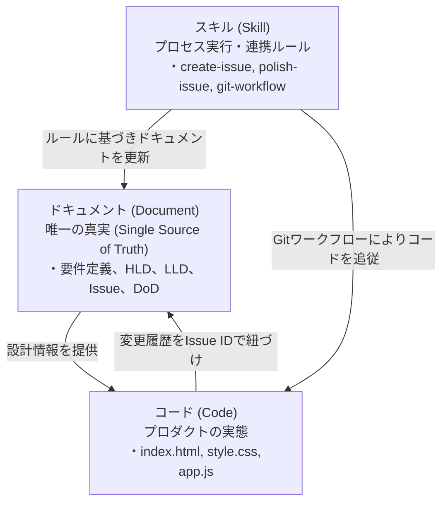

# [MNG-00] 開発哲学・マニフェスト (Development Philosophy & Manifesto) - ゆうぞら (Yuzora)

本ドキュメントは、「ゆうぞら (Yuzora)」プロジェクトにおけるソフトウェア設計・開発・運用に関する基本理念、思考フレームワーク、およびプロセスを律する共通のガバナンスルールを体系的に定義するマニフェストです。

---

## 1. プロダクト理念 (Mission & Core Values)

### 1.1 伝統的かつ美しい日本語読書体験の継承
デジタルデバイス上であっても、本物の紙の書籍を開くような快適で美しい読書体験を再現することを追求します。
* **伝統的組版の尊重**: 縦書き（RTL/LTR）、ルビ（ふりがな）、傍点（強調）などの青空文庫テキストの各種注記を正確に解釈し、美しい文字組みを実現します。
* **心地よい視覚設計**: 紙の質感を感じさせる和紙（セピア）をはじめとする curated な配色テーマや、読みやすい明朝体（Noto Serif JP）/ゴシック体の書体選択など、長時間の読書に耐えうる視覚体験を提供します。

### 1.2 完全クライアントサイド (Serverless) & プライバシー保護
システムのシンプルさ、ゼロコスト運用、およびユーザーデータの絶対的プライバシーを担保するため、サーバーレスでの完結を基本原則とします。
* **サーバー依存の徹底排除**: テキストファイルの読み込み・デコードからパース、レイアウト計算まですべてをクライアントのブラウザ上で行います。
* **ローカル完結のプライバシー**: 読書データ（本の内容、しおり進捗、表示設定）を外部サーバーに一切送信せず、ブラウザの `LocalStorage` のみで保護・完結させます。

---

## 2. UI/UX・デザイン哲学 (UI/UX & Design Philosophy)

### 2.1 直感的な操作（No Manual Needed）
ユーザーがマニュアルを読み込むことなく、起動した瞬間から迷いなく操作できるインターフェースを志向します。
* **自己記述的なUIデザイン**: 操作領域（シークバー、先頭ページへ戻るボタン等）の配置やアイコンデザイン自体が、その機能や動きを視覚的に自己説明するものとします。
* **読書方向（RTL/LTR）と完全に連動したインタラクション**: ページのめくり方向やフッタープログレスバーの進捗増加方向は、設定された読書方向に完全に同期させ、人間の直感的な方向感覚と一致させます。
* **多様な操作チャネルの完全同期**: クリック操作、モバイルでのタッチスワイプ、キーボードによるショートカット（矢印キーやデバッグキー等）のどれを用いても、一貫した制御と同一の読書状態を維持します。

---

## 3. エンジニアリング＆アーキテクチャ哲学 (Engineering & Architecture Philosophy)

### 3.1 反復的かつインクリメンタルな進化 (Iterative & Incremental)
最初から大規模で複雑な完全形を一度に構築するのではなく、動作可能なコア機能から段階的に構築と検証を繰り返し、プロダクトを磨き上げます。各フェーズでフィードバックを取り込み、継続的にコードの精度を高めます。

### 3.2 TOGAF EA による全体最適
システムの拡張性と整合性を保証するため、TOGAF（アーキテクチャ開発手法）の考え方に立脚し、以下の各ドメインをシームレスに紐づけます。
* **ビジネス (BA)**: ユーザーの読書ユースケース（要求定義 REQ-01）
* **アプリケーション (AA)**: クライアントサイドSPAコンポーネント構成（基本設計 DSN-01）
* **データ (DA)**: テキストパース規則、LocalStorageのデータ定義（詳細設計 DSN-02）
* **技術 (TA)**: HTML5/Vanilla CSS/JavaScript、Web標準フォントなどの実行プラットフォーム

### 3.3 抽象と具象の分離 (Separation of HLD and LLD)
コード変更時の影響範囲を最小化し、メンテナンス性を最大化するため、基本設計（HLD: 論理レベル設計）と詳細設計（LLD: 物理レベル実装仕様）の抽象度と関心領域を明確に分離します。

### 3.4 ADR-driven (アーキテクチャ意思決定記録の活用)
設計上のトレードオフや技術選定（例: ライブラリ不使用、純粋なHTML/CSSの採用等）を下した背景と結論を ADR（Architecture Decision Record）として明文化し、技術的負債のブラックボックス化を防ぎます。

### 3.5 セキュリティ・バイ・デザイン ＆ セキュア・バイ・デフォルト (Security by Design ＆ Default)
プロジェクトの信頼性とユーザーの安全性を担保するため、セキュリティを開発の核心的価値として位置づけ、以下の設計原則を遵守します。
* **セキュリティ・バイ・デザイン**: 
  企画・要件定義の初期段階から「脅威モデリング」を導入し、想定される脆弱性や攻撃シナリオを事前に分析して設計にセキュリティ要件を組み込みます。後追いでのセキュリティ対策は原則として禁止します。
* **セキュア・バイ・デフォルト**: 
  システムやコンポーネントは、初期設定および規定の処理フロー自体がデフォルトで最も安全な状態になるように設計します。
  - *エスケープの標準化*: 外部から読み込まれた書籍テキストおよびHTMLデータをパースする際は、自動的にHTMLエスケープ処理を施し、XSS（クロスサイトスクリプティング）を本質的に排除します。
  - *ローカル完結による防衛*: 外部サーバーへの通信を徹底的に排除した完全クライアントサイド実行により、データ漏洩の脅威ベクトルそのものを排除します。

---

## 4. ドキュメント駆動型開発・運用統制の徹底

本プロジェクトでは、暗黙知や場当たり的なコーディングを厳格に排除し、品質を維持するための「ルール、管理策、およびプロセス統制」を最重要視します。

### 4.1 ドキュメント駆動型開発
* **「ドキュメントはコードと同等、あるいはそれ以上の価値を持つ重要な成果物である」**
* 実装の形骸化やデッドコード化、認識ズレを防ぐため、**すべての実装に先立って、必ず要件・設計ドキュメントやIssueチケットを更新・洗練し、承認（Proceed）を得る**プロセスを遵守します。

### 4.2 ルール・管理策・統制 (Rules, Controls, & Governance)
* システムに対するすべての変更（バグ修正、機能追加、リファクタリング）は、定義された変更管理プロセスおよび開発ワークフローに則って厳密にレビューされ、合意された完了条件（DoD）を満たすことをテストによって検証（統制）します。
* AI Agentおよび人間を含むすべての開発者は、これらの管理策を尊重し、ガバナンス体制を維持します。

---

## 5. ドキュメント・スキル・コードの三位一体（連携）モデル

プロジェクトの持続可能性を担保するため、以下の「設計図（ドキュメント）」「実行手順（スキル）」「実装（コード）」が相互に連携し、ドキュメントの腐敗（形骸化）を防止するライフサイクルを構成します。

* **ドキュメント (Document - SOT / 設計図)**:
  要件や論理・物理設計、完了条件（DoD）を規定する、プロジェクトにおける「唯一の真実（Single Source of Truth）」です。
* **スキル (Skill - 実行手順 / 接着剤)**:
  ドキュメントで規定されたルールや管理策を、実務において「いかに実行するか」を標準化したAI/人間向けの手順書。テンプレートのコピーや台帳の自動更新手順を含み、ドキュメントとコードをつなぐ接着剤として機能します。
* **コード (Code - 実態 / プロダクト)**:
  ドキュメントの仕様通りに構築され、テストを通じて保証された実行コードです。

### 5.1 連携ルールとトレーサビリティ
* スキル手順によって、コードを変更する際は必ずドキュメント（Issueチケットや設計書）の更新を先行させます。
* コードの変更履歴（コミットメッセージや `CHANGES.md`）には必ず Issue ID を含め、どの変更がどのドキュメント（Issue）に対応しているかを常にトレーサブル（追跡可能）にします。これにより、ドキュメントの腐敗（仕様とコードの乖離）を恒久的に防止します。
