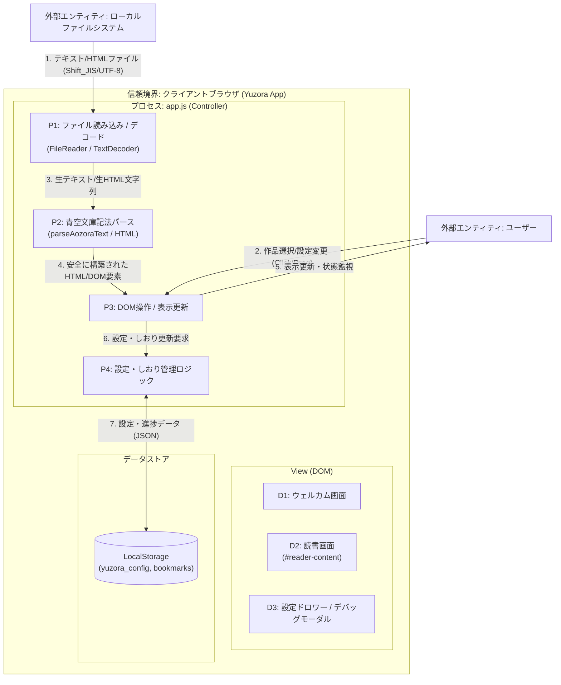

# [MNG-07] 脅威モデリング定義書 (Threat Modeling Framework) - ゆうぞら (Yuzora)

本ドキュメントは、「ゆうぞら (Yuzora)」プロジェクトにおいて、セキュリティ・バイ・デザイン（Security by Design）の原則に基づき、設計および開発の初期段階からセキュリティ上の脅威を識別・分析・緩和するための「脅威モデリング」のフレームワークを定義します。

---

## 1. 目的とスコープ (Purpose & Scope)

### 1.1 目的
システムの要件定義および設計フェーズにおいて、潜在的な攻撃ベクトルや脆弱性を構造的に分析（モデリング）し、適切なセキュリティ管理策（緩和策）をあらかじめ設計仕様に組み込むことで、手戻りの防止とセキュアなアプリケーションの構築を実現します。

### 1.2 対象スコープ
完全クライアントサイド（Serverless）で動作する「ゆうぞら」アプリケーションにおける以下の要素：
* 外部ファイル入力部（ドラッグ＆ドロップ、ファイル選択）
* 青空文庫テキスト/HTMLのデコード・パース処理エンジン
* ブラウザ永続ストレージ（LocalStorage）
* ビューアー画面の描画・制御層 (DOM)

---

## 2. STRIDEモデルに基づく脅威分析手法

本プロジェクトでは、Microsoftが提唱するセキュリティ脅威の分類手法である **STRIDE** を適用し、セキュリティ分析を行います。

| 脅威分類 | 定義 (Definition) | ゆうぞらにおける想定リスク |
| :--- | :--- | :--- |
| **S: Spoofing** (なりすまし) | 信頼されたアイデンティティやオブジェクトに偽装してシステムに不正侵入する脅威。 | ・悪意ある事前定義作品のマスターデータを偽装・挿入し、ユーザーに読み込ませる。 |
| **T: Tampering** (改ざん) | データやアセットの整合性を破壊する、不正な改ざん・書き換えの脅威。 | ・ブラウザの `LocalStorage` の設定値やしおりデータを直接改ざんし、パース時のバグやXSSを誘発する。 |
| **R: Repudiation** (否認) | 操作やトランザクションの実施を証明できず、履歴を否定される脅威。 | ・（完全サーバーレスのためサーバーログは存在しないが）ローカルストレージの状態不整合やしおり破損の不具合時に原因特定を否認・隠蔽される。 |
| **I: Information Disclosure** (情報漏洩) | 機密データやプライベートな情報が、不認可の第三者に閲覧・暴露される脅威。 | ・読み込んだ本の内容、読書履歴、設定情報などが、意図しない外部へのHTTP通信（XSSや悪意あるスクリプト）によって漏洩する。 |
| **D: Denial of Service** (サービス拒否) | リソースを枯渇させ、正当なユーザーに対するサービス提供を不能にする脅威。 | ・�3. **緩和策の策定**: 抽出した脅威に対し、エスケープ処理や型制限などのセキュリティコントロール（設計）を施し、その内容を実装計画書およびDoD（完了条件）に記載します。�、必ず以下の手順で脅威モデリングを実施します。

1. **データフロー (DFD) の図式化**: 変更によって「どこからデータが入力され」「どのモジュールで処理され」「どこに保存され」「どう画面に出力されるか」を明らかにします。
2. **STRIDEによる脅威抽出**: 各データフローの境界線において、STRIDEに該当する脆弱性がないか評価します。
3. **緩和策の策定**: 抽出した脅威に対し、エスケープ処理や型制限などのセキュリティコントロール（設計）を施し、その内容を実装計画書およびDoD（完了条件）に記載します。

---

## 5. システムデータフローダイアグラム (DFD)

ゆうぞらにおけるデータの流れと信頼境界（Trust Boundary）は、以下の図の通りです。

---

## 6. STRIDE脅威分析結果シート (Threat Analysis Sheet)

現在のゆうぞらシステムにおいて識別されている脅威、想定される影響、および実装されているセキュリティ緩和策の一覧です。

| 脅威ID | 脅威分類 (STRIDE) | 関連要素 (DFD) | 脅威シナリオ（具体的な攻撃・事象） | 影響度 | 現在のセキュリティ緩和策（実装） | 今後の推奨対策 |
| :--- | :--- | :--- | :--- | :--- | :--- | :--- |
| **T-S1** | **Spoofing** (なりすまし) | P1, P3, D1 | 攻撃者が悪意ある事前定義作品のパスを改ざんし、外部の偽の書籍データをフェッチさせ、表示を偽装する。 | Low | ・`PREDEFINED_BOOKS` のフェッチパスはローカルの静的リソース（`src/books/`）にハードコードされており、外部ドメインからの取得を許可しない設計。 | ・作品リストのパスが固定値から変更されないことを、ビルド/テスト時に検証する。 |
| **T-T1** | **Tampering** (改ざん) | P4, LocalStorage | ブラウザの `LocalStorage` にあるしおりデータや設定オブジェクトを直接改ざんし、ロード時に例外を発生させてアプリをクラッシュさせる。 | Medium | ・LocalStorageからの読み込み時に `try-catch` 処理を施し、パース失敗時はデフォルトの設定（フォントサイズ・テーマ等）へフォールバックするロジックを実装。 | ・しおりデータの数値パラメータ（進捗率: 0.0〜1.0）の範囲外エラーチェックを強化する。 |
| **T-T2** | **Tampering** (改ざん) | P4, LocalStorage, P3 | `LocalStorage` の設定オブジェクト値に不正な文字列（悪意あるCSSクラス名等）を注入され、描画時にレイアウトを改ざんされる。 | Low | ・読み込んだ設定値は、定義済みのテーマ（sepia/light/dark/black）などのホワイトリストに合致しているか検証し、適合しない値は適用を拒否する。 | ・ホワイトリスト検証処理をすべての設定パラメータに対して網羅する。 |
| **T-R1** | **Repudiation** (否認) | P3, User | 表示ズレやしおり保存の不具合が発生した際、サーバーが存在しないため動作ログがなく、不具合の事実や原因究明を否認される。 | Low | ・デバッグモーダル内に「レイアウト/見切れ診断機能」を実装し、ユーザー自身が診断を実行してMarkdown形式の診断結果レポートをバグ報告時に添付できる仕組みを提供。 | ・エラー発生時に、ローカル状態スタックを一時的にダンプ・出力するヘルプ機能を追加する。 |
| **T-I1** | **Information Disclosure** (情報漏洩) | ClientApp, Storage | 読み込んだ本の内容、しおりの進捗履歴、およびユーザーの設定情報が、悪意あるスクリプト等を介して外部サーバーに窃取・送信される。 | High | ・完全クライアントサイド（Serverless）設計を徹底。アプリ起動後の外部ドメインへのHTTP/HTTPSリクエスト、トラッキングAPIの通信を一切排除。 | ・Content Security Policy (CSP) を定義し、外部へのコネクション（`connect-src`）を制限する。 |
| **T-D1** | **Denial of Service** (サービス拒否) | P1, P2 | 数十MBを超える極めて巨大なテキスト/HTMLファイルをドロップされ、デコード・パース処理でブラウザのメインスレッドをフリーズさせる。 | Medium | ・（未実装）ファイル入力時にサイズ検証を行い、一定上限値（例: 2MB）を超える場合はエラーを表示して処理を即座に中断するサイズチェックを追加予定。 | ・ファイルインプットイベント時のサイズチェック処理（DoDに含める）の実装。 |
| **T-E1** | **Elevation of Privilege** (権限昇格) | P2, P3, D2 | プレーンテキストファイル（.txt）の本文内に埋め込まれた `<script>` などのタグがエスケープされずにDOM描画され、XSSを実行される。 | High | ・`parseAozoraText` 内の文字列処理の最優先ステップとして、`&` -> `&amp;`, `<` -> `&lt;`, `>` -> `&gt;` のHTML特殊文字一括エスケープを強制実施。 | ・自動レビュー（review-diff-code）において、エスケープ漏れが混入しないことを静的チェック。 |
| **T-E2** | **Elevation of Privilege** (権限昇格) | P2, P3, D2 | HTML形式（.html/.xhtml）のファイルを読み込んだ際、本文内に埋め込まれた悪意あるスクリプトが実行される（XSS）。 | High | ・`DOMParser` を経由してパース後、安全な本文要素（`.main_body`）のみを抽出し、不要なスクリプトタグや外部イベント属性を明示的に `remove()` 除去。 | ・HTMLパース時に、安全なHTML要素・属性のみを許可するサニタイズ処理を強化する。 |
