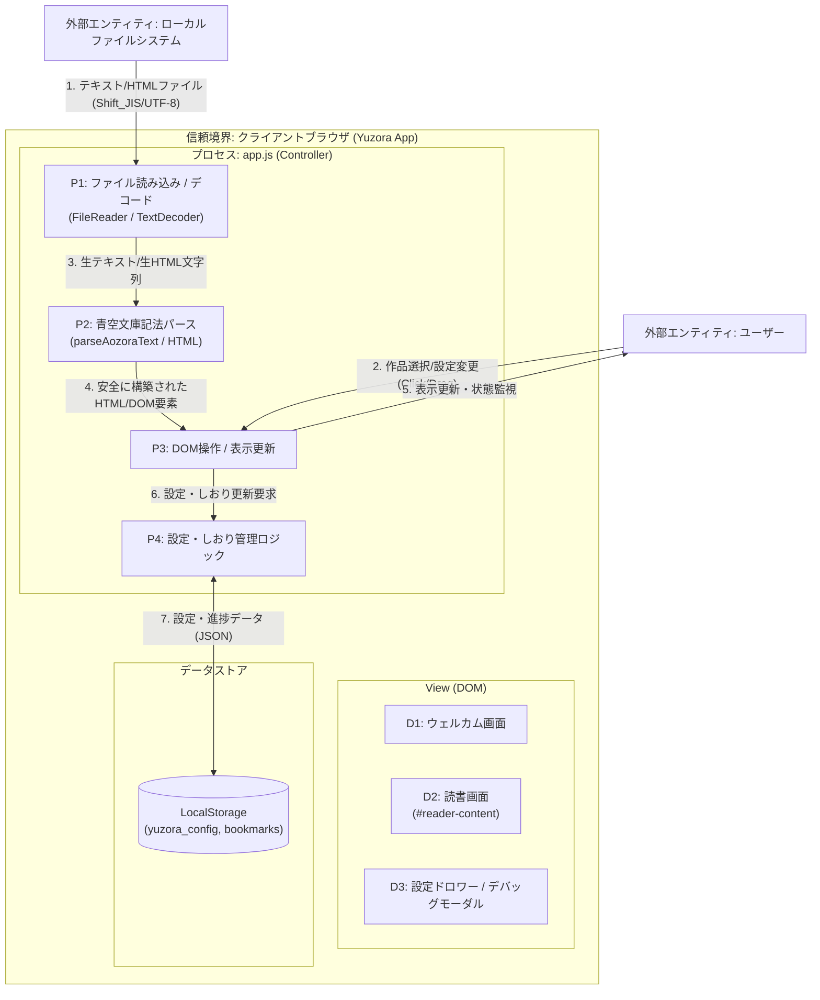

# [MNG-07] 脅威モデリング定義書 (Threat Modeling Framework) - ゆうぞら (Yuzora)

本ドキュメントは、「ゆうぞら (Yuzora)」プロジェクトにおいて、セキュリティ・バイ・デザイン（Security by Design）の原則に基づき、設計および開発の初期段階からセキュリティ上の脅威を識別・分析・緩和するための「脅威モデリング」のフレームワークを定義します。

---

## 1. 目的とスコープ (Purpose & Scope)

### 1.1 目的
システムの要件定義および設計フェーズにおいて、潜在的な攻撃ベクトルや脆弱性を構造的に分析（モデリング）し、適切なセキュリティ管理策（緩和策）をあらかじめ設計仕様に組み込むことで、手戻りの防止とセキュアなアプリケーションの構築を実現します。

### 1.2 対象スコープ
完全クライアントサイド（Serverless）で動作する「ゆうぞら」アプリケーションにおける以下の要素：
* 外部ファイル入力部（ドラッグ＆ドロップ、ファイル選択）
* 青空文庫テキスト/HTMLのデコード・パース処理エンジン
* ブラウザ永続ストレージ（LocalStorage）
* ビューアー画面の描画・制御層 (DOM)

---

## 2. STRIDEモデルに基づく脅威分析手法

本プロジェクトでは、Microsoftが提唱するセキュリティ脅威の分類手法である **STRIDE** を適用し、セキュリティ分析を行います。

| 脅威分類 | 定義 (Definition) | ゆうぞらにおける想定リスク |
| :--- | :--- | :--- |
| **S: Spoofing** (なりすまし) | 信頼されたアイデンティティやオブジェクトに偽装してシステムに不正侵入する脅威。 | ・悪意ある事前定義作品のマスターデータを偽装・挿入し、ユーザーにロードさせる。 |
| **T: Tampering** (改ざん) | データやアセットの整合性を破壊する、不正な改ざん・書き換えの脅威。 | ・ブラウザの `LocalStorage` の設定値やしおりデータを直接改ざんし、パース時のバグやXSSを誘発する。 |
| **R: Repudiation** (否認) | 操作やトランザクションの実施を証明できず、履歴を否定される脅威。 | ・完全サーバーレスのためサーバーログは存在しないが、ローカルストレージの状態不整合やしおり破損の不具合時に原因特定を否認・隠蔽される。 |
| **I: Information Disclosure** (情報漏洩) | 機密データやプライベートな情報が、不認可の第三者に閲覧・暴露される脅威。 | ・読み込んだ本の内容、読書履歴、設定情報などが、意図しない外部へのHTTP通信（XSSや悪意あるスクリプト）によって漏洩する。 |
| **D: Denial of Service** (サービス拒否) | リソースを枯渇させ、正当なユーザーに対するサービス提供を不能にする脅威。 | ・巨大なファイルや無限ループなどの異常なテキストを処理させ、ブラウザのメインスレッドをフリーズさせてアプリを使用不能にする。 |
| **E: Elevation of Privilege** (権限昇格) | 本来許可されていない特権や操作権限を取得・実行される脅威。 | ・本文内に悪意あるスクリプトが混入し、アプリの実行コンテキストで任意の JavaScript が実行される（XSS）。 |

---

## 3. 情報ベースの脅威分析：情報アセットの分類とセキュリティ要件

本システムにおいて処理および保存される主要な情報（データ）アセットの定義と、それぞれのセキュリティ要件（機密性・完全性・可用性：C-I-A）および想定される脅威シナリオのまとめです。

| 情報アセット名 | 処理・保存場所 | 主なデータ内容 | 機密性 (C) | 完全性 (I) | 可用性 (A) | 想定される脅威シナリオとセキュリティ要件 |
| :--- | :--- | :--- | :--- | :--- | :--- | :--- |
| **書籍コンテンツデータ** | メモリ（JS変数）、表示DOM（`#reader-content`） | ユーザーがロードした小説テキストまたはHTML/XHTML文字列。 | **Medium** (私的文書の保護) | **High** (XSS防止) | **Medium** (ロードフリーズ防止) | ・**脅威**: XHTML内に悪意あるスクリプトが混入し、実行される（XSS）。 ・**要件**: ホワイトリスト方式のサニタイズ（T-E2）およびエスケープ処理（T-E1）を施し、安全なDOM要素のみを描画する。 |
| **しおり・読書進捗データ** | メモリ、ブラウザの `LocalStorage` (`bookmarks`) | 各書籍（ファイル名・事前定義ID）ごとの最終既読ページおよび進捗率。 | **Medium** (プライバシー保護) | **Medium** (データ破壊防止) | **Medium** (履歴の維持) | ・**脅威**: 悪意あるスクリプト等により読書履歴が外部に送信される（情報漏洩）。またはLocalStorage改ざんでアプリがクラッシュする。 ・**要件**: 外部ドメインへの接続をCSP（T-I1）で遮断する。またロード時にtry-catchでデフォルトにフォールバックする（T-T1）。 |
| **UI表示設定データ** | メモリ、ブラウザの `LocalStorage` (`yuzora_config`) | 選択された背景色テーマ、フォントサイズ、書体、文字間、行間等の設定オブジェクト。 | **Low** (非機密情報) | **Medium** (設定改ざん防止) | **Medium** (設定の維持) | ・**脅威**: 不正なCSSクラス名や規格外の値を注入され、ロード時に表示が崩壊する。 ・**要件**: 読み込んだ設定値がホワイトリスト（sepia/light/dark/black等）に適合するか検証し、不適合時は適用を拒否する（T-T2）。 |

---

## 4. 脅威モデリングの実施基準と手順 (Process & Criteria)

### 4.1 実施基準
以下の変更または新規実装を行う場合、必ず事前に脅威モデリングを実施し、`docs/threat-modeling/comprehensive-threat-modeling.md` に反映する必要があります。
1. 新たな入力データソース（ファイル形式、外部API等）の追加
2. パース処理ロジックの主要な改修
3. ローカルストレージなど永続化データの読み書きスキーマの変更
4. 信頼境界をまたぐ通信処理の追加

### 4.2 実施手順
必ず以下の手順で脅威モデリングを実施します。
1. **情報アセットの特定とセキュリティ要件定義**: 変更対象となる機能において「どのような情報（アセット）が処理・保存されるか」を特定し、その機密性・完全性・可用性（C-I-A）に対するセキュリティ要件を定義します。
2. **データフロー (DFD) の図式化**: 変更によって「どこからデータが入力され」「どのモジュールで処理され」「どこに保存され」「どう画面に出力されるか」を明らかにします。
3. **STRIDEによる脅威抽出**: 各データフローの境界線や信頼境界において、STRIDEに該当する脆弱性がないか評価します。
4. **緩和策の策定**: 抽出した脅威に対し、エスケープ処理や型制限、サニタイズなどのセキュリティコントロール（設計）を施し、その内容を実装計画書およびDoD（完了条件）に記載します。

---

## 5. システムデータフローダイアグラム (DFD)

ゆうぞらにおけるデータの流れと信頼境界（Trust Boundary）は、以下の図の通りです。

---

## 6. STRIDE脅威分析結果シート (Threat Analysis Sheet)

現在のゆうぞらシステムにおいて識別されている脅威、想定される影響、および実装されているセキュリティ緩和策の一覧です。
※最新の分析ステータスおよび詳細情報（マージ済みIssueリンク等）は、[包括的脅威モデリング結果](threat-modeling/comprehensive-threat-modeling.md) を一次情報（SOT）として管理します。

| 脅威ID | 脅威分類 (STRIDE) | 関連要素 (DFD) | 脅威シナリオ（具体的な攻撃・事象） | 影響度 | 現在のセキュリティ緩和策（実装） | 今後の推奨対策 | ステータス | 対応するIssue |
| :--- | :--- | :--- | :--- | :--- | :--- | :--- | :--- | :--- |
| **T-S1** | **Spoofing** (なりすまし) | P1, P3, D1 | 攻撃者が悪意ある事前定義作品のパスを改ざんし、外部の偽の書籍データをフェッチさせ、表示を偽装する。 | Low | ・`PREDEFINED_BOOKS` のフェッチパスはローカルの静的リソース（`src/books/`）にハードコードされており、外部ドメインからの取得を許可しない設計。 | ・作品リストのパスが固定値から変更されないことを、ビルド/テスト時に検証する。 | Mitigated | - |
| **T-T1** | **Tampering** (改ざん) | P4, LocalStorage | ブラウザの `LocalStorage` にあるしおりデータや設定オブジェクトを直接改ざんし、ロード時に例外を発生させてアプリをクラッシュさせる。 | Medium | ・LocalStorageからの読み込み時に `try-catch` 処理を施し、パース失敗時はデフォルトの設定（フォントサイズ・テーマ等）へフォールバックするロジックを実装。 | ・しおりデータの数値パラメータ（進捗率: 0.0〜1.0）の範囲外エラーチェックを強化する。 | Mitigated | - |
| **T-T2** | **Tampering** (改ざん) | P4, LocalStorage, P3 | `LocalStorage` の設定オブジェクト値に不正な文字列（悪意あるCSSクラス名等）を注入され、描画時にレイアウトを改ざんされる。 | Low | ・読み込んだ設定値は、定義済みのテーマ（sepia/light/dark/black）などのホワイトリストに合致しているか検証し、適合しない値は適用を拒否する。 | ・ホワイトリスト検証処理をすべての設定パラメータに対して網羅する。 | Mitigated | - |
| **T-R1** | **Repudiation** (否認) | P3, User | 表示ズレやしおり保存の不具合が発生した際、サーバーが存在しないため動作ログがなく、不具合の事実や原因究明を否認される。 | Low | ・デバッグモーダル内に「レイアウト/見切れ診断機能」を実装し、ユーザー自身が診断を実行してMarkdown形式の診断結果レポートをバグ報告時に添付できる仕組み提供。 | ・エラー発生時に、ローカル状態スタックを一時的にダンプ・出力するヘルプ機能を追加する。 | Mitigated | - |
| **T-I1** | **Information Disclosure** (情報漏洩) | ClientApp, Storage | 読み込んだ本の内容、しおりの進捗履歴、およびユーザーの設定情報が、悪意あるスクリプト等を介して外部サーバーにアクセス・送信される。 | High | ・Content Security Policy (CSP) を導入し、外部へのコネクション（`connect-src 'self'`）や不要なリソース取得を制限。([Issue 007](../issues/closed/007-enforce-csp-mitigation-t-i1.md) にて修正済) | ・自動レビュー（review-diff-code）において、CSP設定が除去されないことを静的チェック。 | Resolved | [Issue 007](../issues/closed/007-enforce-csp-mitigation-t-i1.md) |
| **T-D1** | **Denial of Service** (サービス拒否) | P1, P2 | 数十MBを超える極めて巨大なテキスト/HTMLファイルをドロップされ、デコード・パース処理でブラウザのメインスレッドをフリーズさせる。 | Medium | ・（未実装）ファイル入力時にサイズ検証を行い、一定上限値（例: 2MB）を超える場合はエラーを表示して処理を即座に中断するサイズチェックを追加予定。 | ・ファイルインプットイベント時のサイズチェック処理（DoDに含める）の実装。 | Open | - |
| **T-E1** | **Elevation of Privilege** (権限昇格) | P2, P3, D2 | プレーンテキストファイル（.txt）の本文内に埋め込まれた `<script>` などのタグがエスケープされずにDOM描画され、XSSを実行される。 | High | ・`parseAozoraText` 内の文字列処理の最優先ステップとして、`&` -> `&amp;`, `<` -> `&lt;`, `>` -> `&gt;` のHTML特殊文字一括エスケープを強制実施。([Issue 005](../issues/closed/005-fix-xss-vulnerability-t-e1.md) にて修正済) | ・自動レビュー（review-diff-code）において、エスケープ漏れが混入しないことを静的チェック。 | Resolved | [Issue 005](../issues/closed/005-fix-xss-vulnerability-t-e1.md) |
| **T-E2** | **Elevation of Privilege** (権限昇格) | P2, P3, D2 | HTML形式（.html/.xhtml）のファイルを読み込んだ際、本文内に埋め込まれた悪意あるスクリプトが実行される（XSS）。 | High | ・`DOMParser` を経由してパース後、ホワイトリスト方式で安全なHTMLタグおよび属性のみを許可するサニタイズ処理（`sanitizeDOM`）を実施。([Issue 006](../issues/closed/006-fix-xss-vulnerability-t-e2.md) にて修正済) | ・自動レビュー（review-diff-code）において、サニタイズ処理のバイパスが混入しないことを静的チェック。 | Resolved | [Issue 006](../issues/closed/006-fix-xss-vulnerability-t-e2.md) |
