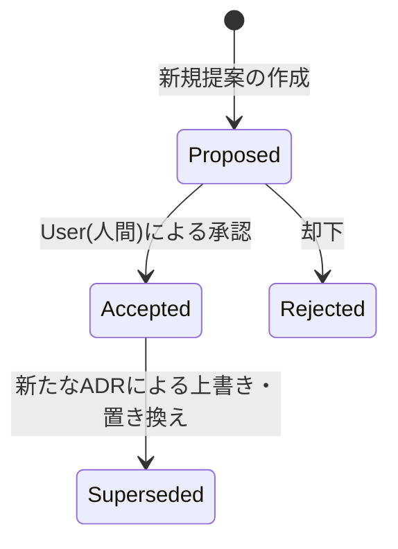

# [MNG-08] アーキテクチャ意思決定プロセス (ADR Process Definition)

## 1. 概要と目的

システム開発において、トレードオフの伴う重要な技術選定やアーキテクチャの変更、複雑なアルゴリズムの設計などに関する意思決定は、その背景、検討された代替案、および結果（メリット・デメリット・追加影響）とともに記録される必要があります。
本ドキュメントは、**ADR (Architecture Decision Record)** の導入基準、テンプレート、ライフサイクル、および運用手順を規定し、プロジェクトにおける技術的な意思決定のブラックボックス化を防ぎ、将来の保守性および拡張性を担保することを目的とします。

---

## 2. ADR の起票基準 (Scope & Triggers)

すべての軽微な設計変更に対して ADR を作成する必要はありません。以下に示すような、**プロジェクトに長期的な影響を与える重要な意思決定**を行う場合に ADR を起票します。

* **技術スタックの採用・変更**:
  - 新たな言語、フレームワーク、主要ライブラリ（または外部依存関係）の導入またはバージョンアップ。
  - Web APIs やブラウザ標準機能の根本的な技術選定（例: `fetch` API の採用、`localStorage` の利用方式など）。
* **システムアーキテクチャの変更**:
  - コンポーネント間の依存関係や境界の変更（例: MVCモデルのレイヤー構造の再定義）。
  - クライアントサイドとサーバーサイドの責務境界の変更。
* **データ構造および永続化設計の変更**:
  - `localStorage` 等における保存データ構造（スキーマ）やバージョン管理方式の決定（例: しおりデータの保存形式変更）。
  - 外部ファイルインポート時のデコードやキャッシュの方針決定。
* **複雑なアルゴリズムやUI/UX制御方針の選定**:
  - 青空文庫記法のパース方式（正規表現による段階的置換ルールなど）。
  - 縦書き（RTL）における文字・ページスクロール位置計算、ページ切り替えアニメーションの制御方針など。

---

## 3. ADR テンプレート (Template)

ADR は、以下のフォーマットに従って `docs/adr/ADR-<2桁連番>-<lowercase-hyphenated-title>.md` というファイル名で作成します（例: `docs/adr/ADR-01-predefined-books-and-storage.md`）。

```markdown
# [ADR-XX] タイトル

## 日付
YYYY-MM-DD (意思決定または提案が行われた日付)

## ステータス
Proposed (提案中) / Accepted (承認済) / Rejected (却下) / Superseded (置き換え済)

## コンテキスト
解決すべき課題、技術的な制約事項、選択肢を設けた背景などを記述します。
比較検討した代替案や、それぞれのメリット・デメリットを記載してください。

## 意思決定
最終的に決定したアプローチ、設計内容、および採用理由を具体的に記述します。

## 結果
この意思決定によって発生する影響や、今後の設計・開発に与える制約を記述します。
- メリット (得られる価値)
- デメリット / リスク (許容すべき制限事項)
- 発生する追加タスクや技術的負債
- 他のADRや設計書への影響
```

---

## 4. ADR のライフサイクルとステータス定義 (Status Lifecycle)

ADR のステータスは以下のように遷移します。



* **Proposed (提案中)**:
  - AI Agent または開発者が技術提案を起票し、ドラフトを作成した状態。
  - 実装を伴うIssueの「精査（polish-issue）」フェーズにおいて提案されます。
* **Accepted (承認済)**:
  - ユーザー（人間）によって提案がレビューされ、承認された状態。
  - 承認された設計に沿ってコード実装が進行します。
* **Rejected (却下)**:
  - レビューの結果、採用が見送られた状態。
  - 背景や却下理由は、ドキュメントの「意思決定」または「結果」に記録として残します（履歴としての価値があるため、ファイル自体は削除しません）。
* **Superseded (置き換え済)**:
  - 開発の進展により、過去の決定事項を新たな設計で上書きする必要が生じた状態。
  - 置き換えた古いADRのステータスを `Superseded` に変更し、新ADRへの参照リンクを貼ります。新ADR側でも、どの過去ADRを上書きしたかを明示します。

---

## 5. 運用プロセスとルール (Workflow Rules)

1. **Issue 駆動での起票**:
   - 開発中または分析中に起票基準を満たす設計変更が発生した場合、該当Issueの精査（`polish-issue`）の中で ADR を `Proposed` として起票します。
2. **三位一体モデルとの整合**:
   - ADRでの決定事項は、ただちに基本設計（[DSN-01](/docs/DSN-01-high_level_design.md)）および詳細設計（[DSN-02](/docs/DSN-02-low_level_design.md)）に反映させ、ドキュメント全体の整合を保たなければなりません。
3. **承認とマージのトリガー**:
   - ADRのステータスを `Accepted` に更新するためには、必ず User（人間）の明示的なレビューと承認（合意）が必要です。
   - 承認が得られたADRは、Issueチケットのクローズや成果物のマージプロセスと同期して、Gitメインブランチにマージされます。
