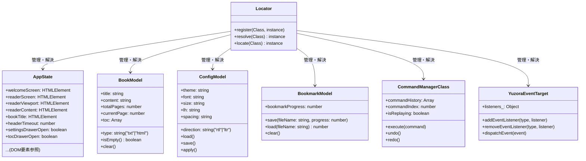

# [REFACTOR] クラス設計の統合とすべての状態・プロパティのカプセル化 (ID: 029)

## 1. 概要 / Summary
現在、Yuzoraは `Locator` パターンと `AppState` クラスを利用して状態管理を行っていますが、一部にレガシーなプロキシプロパティ（`window.currentFileName` 等）や、DOM要素へのアドホックな参照、およびグローバルスコープに近い位置で保持されている変数・参照が存在しています。

本リファクタリングでは、クラス設計（オブジェクトの設計およびその関係性）を徹底的に見直し、**「すべてのプロパティおよび状態は、明確な役割を持つ何らかのオブジェクト/クラスに属する」** 設計を完成させます。

これにより、グローバルなフットプリント（状態の隠れた依存関係）を完全に排除し、各モジュール（UI、Viewer、Parser、Diagnostics）がどのオブジェクトを所有または参照しているかの関係性をクリアにし、Closure Compilerの `ADVANCED_OPTIMIZATIONS` 環境下における型安全と難読化の整合性を極限まで高めます。

---

## 2. 影響範囲と関連ファイル / Scope and Affected Files
- [MODIFY] [config.js](../../src/js/modules/config.js) (AppStateクラスの再設計、およびドメインモデルクラス群の新設)
- [MODIFY] [locator.js](../../src/js/modules/locator.js) (Locatorへの新規モデルクラス登録)
- [MODIFY] [ui.js](../../src/js/modules/ui.js) (レガシープロキシ（`currentFileName` 等）へのアクセスをクラスプロパティアクセスへ完全移行)
- [MODIFY] [viewer.js](../../src/js/modules/viewer.js) (同上)
- [MODIFY] [commands.js](../../src/js/modules/commands.js) (同上)
- [MODIFY] [tools/externs.js](../../tools/externs.js) (新規クラス用のextern定義の追加・プロキシ定義の削除)

---

## 3. 要件と設計案 / Requirements & Tentative Class Diagram

### 3.1 クラス関係図 (Class Relationships)

各役割に応じたドメインクラス群を定義し、Locatorを介して依存解決を行います。

### 3.2 移行手順 (Migration Steps)

1. **クラス定義の新設 (`config.js`)**:
   - `BookModel`, `ConfigModel`, `BookmarkModel` クラスを定義。
   - `AppState` から DOM 以外の状態（`currentFileName`, `bookmarkProgress`, `config` 等）をこれらの新規クラスへと切り出す。
   
2. **Locatorへの登録**:
   - アプリ起動初期段階で、新設されたモデルクラス群をLocatorへ登録。

3. **参照コードの書き換え**:
   - `commands.js`, `viewer.js`, `ui.js` において、`window.currentFileName` や `state.config` を直接参照している箇所を以下のように書き換える：
     - `window.currentFileName` ➔ `locator.resolve(BookModel).title`
     - `state.config.theme` ➔ `locator.resolve(ConfigModel).theme`
     - `state.bookmarkProgress` ➔ `locator.resolve(BookmarkModel).bookmarkProgress`

4. **レガシープロキシの完全削除**:
   - 互換性のために `config.js` 末尾に定義されていた `Object.defineProperty` プロキシゲッター/セッターをすべて削除する。これでグローバル名前空間が100%クリーンになる。

5. **externsの整理**:
   - `tools/externs.js` からプロキシ用プロパティ定義を削除し、新規クラス用のインターフェース定義を追加。

---

## 4. 完了条件 / Success Criteria (DoD)
- [ ] すべてのグローバル変数・プロキシプロパティ（`window.currentFileName` 等）が完全に削除され、読み込み・書き込みともにLocator解決モデルに移行していること。
- [ ] リファクタリング適用後、`make clean && make` が警告無しでビルド完了し、アドバンスドコンパイルによる名前衝突やリネーム不具合が一切発生しないこと。
- [ ] すべてのユニットテストおよびE2Eテストが正常にパスし、書籍ロード・しおり保存復元・表示設定変更がデグレードなく機能すること。
