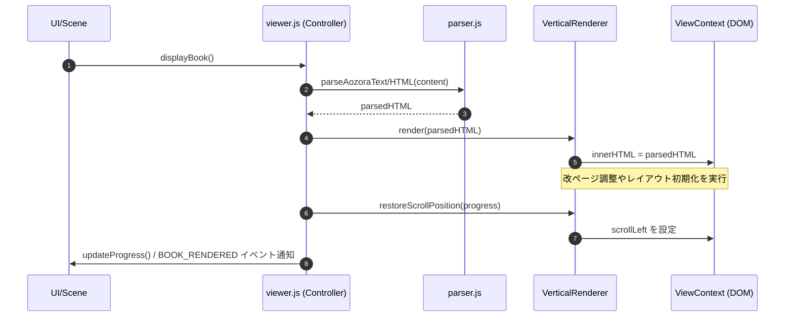

# [REFACTOR] レンダラー（Renderer）クラスの導入による描画ロジックの分離 (ID: 036)

## 1. 概要 / Summary
現在、青空文庫テキストのパース（`parser.js`）以外の、縦書きマルチカラムレイアウトの計算、ページ分割、リフロー制御、RTLにおけるスクロール位置の調整などの具体的なHTML/DOM描画ロジックが [viewer.js](../../src/js/modules/viewer.js) などのコントローラ層に組み込まれています。
表示と制御の関心事を明確に分離し、保守性と拡張性を向上させるため、描画・レイアウト計算処理を専門に扱う `Renderer`（または `LayoutEngine`）を導入します。

具体的には：
- パース済みの抽象データ（AST等）を受け取り、ブラウザの表示枠（ビューポート）に合わせたページレイアウト計算を行う。
- 文字サイズやフォント変更時のリフロー計算を一元管理する。
- 将来的な「横書き表示モード」や「段組レイアウト変更」に対し、コントローラ側のコードを変更することなく、異なる `Renderer` 具象クラス（例: `VerticalRenderer` / `HorizontalRenderer`）を差し替えることで対応可能にする。

---

## 2. 設計アプローチ & シーケンス / Design Approach & Sequence

### アーキテクチャ構成
1. **`Renderer` インターフェース**:
   - 表示に関するライフサイクルメソッドを定義。(`render()`, `restoreScrollPosition()`, `scrollToPage()`, `handleResize()`, `cleanup()`)
2. **`VerticalRenderer` (縦書き具象クラス)**:
   - 現行の `viewer.js` 内の縦書きマルチカラムレイアウトの座標計算やリサイズ制御ロジックをカプセル化して実装。
3. **`RendererFactory` / `Locator` での解決**:
   - `Locator` を用いて、設定（縦書き/横書き）に応じた適切な `Renderer` インスタンスを `viewer.js` に提供する。

### シーケンスフロー (書籍読み込み・描画)

---

## 3. 影響範囲と関連ファイル / Scope and Affected Files

- **[NEW] [renderer.js](file:///workspace/yuzora/yuzora/src/js/modules/renderer.js)**:
  - `Renderer` インターフェース、`VerticalRenderer` 具象クラスの新規実装。
- **[MODIFY] [viewer.js](file:///workspace/yuzora/yuzora/src/js/modules/viewer.js)**:
  - コントローラ内の描画ロジック（`displayBook`, `restoreScrollPosition`, `scrollToPage`, `handleResize` 内のレイアウト計算）を `Renderer` に委譲するようリファクタリング。
- **[MODIFY] [types.d.ts](file:///workspace/yuzora/yuzora/src/js/types.d.ts)**:
  - `Renderer` インターフェースおよび具象クラスの型定義を追加。
- **[MODIFY] [DSN-02-low_level_design.md](file:///workspace/yuzora/yuzora/docs/DSN-02-low_level_design.md)**:
  - 低レベル設計書を更新し、新規導入する `Renderer` クラスの役割を追記。

---

## 4. 要件 & 技術的詳細 / Requirements & Technical Details

1. **JSDoc & 静的型チェックの準拠**:
   - 新規作成するクラスは JSDoc による型アノテーションを完全に付与し、`tsc --noEmit` でエラーが出ないようにする。
2. **既存挙動の維持 (RTL対応)**:
   - 縦書き（`vertical-rl`, `vertical-lr`）におけるスクロール方向の違いによる座標計算、スクロールの挙動、ページ送りの挙動を崩さずにそのまま移植する。
3. **セキュリティ考慮 (Defense in Depth)**:
   - DOM への書き込み窓口を `Renderer.render()` 内に集約させることで、将来のセキュアレンダラー (039) やサニタイズ処理の統合を容易にする設計にする。

---

## 5. 完了条件 / Success Criteria (DoD)

- [ ] `VerticalRenderer` クラスが新規作成され、既存の `viewer.js` 内の描画・レイアウトロジックが美しくカプセル化されていること。
- [ ] 読書画面への遷移、スクロール、ページ送り（前後）、ウィンドウリサイズ時のレイアウト調整が、既存と同様に正常に機能すること。
- [ ] `npm run lint` および `npm run test:unit`, `npm run test:e2e` がすべて正常にパスすること。

