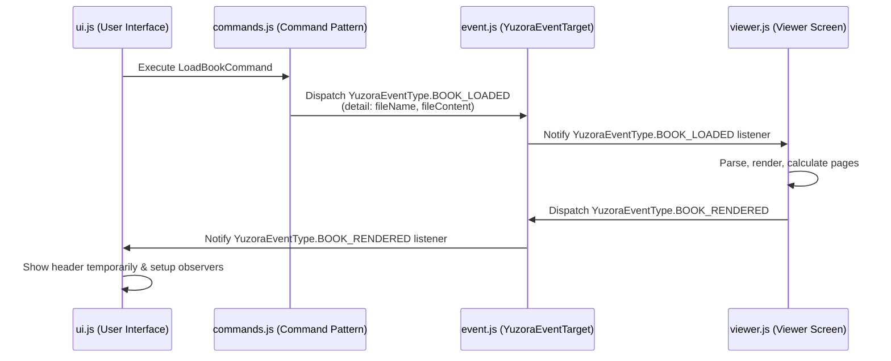

# [REFACTOR] 読書ビューアーのドメイン固有イベントの定義 (ID: 022)

## 1. 概要 / Summary
`Event` 登録・発火機構の導入（ID: 021）に続き、青空文庫縦書きビューアーのビジネスロジックやドメイン固有のイベントを明確に定義し、モジュール間の疎結合（疎結合イベント駆動アーキテクチャ）をさらに推進します。

イベントのマジックストリング使用を排除するために、各イベントを型安全なクラスまたは定数として定義し、どのようなペイロード（データ型）がどのタイミングでやり取りされるかをドキュメントおよびコード上で厳密に定義します。

---

## 2. 影響範囲と関連ファイル / Scope and Affected Files
- [MODIFY] [event.js](../../src/js/modules/event.js) (ドメインイベント群の具象クラス・定数を追記)
- [MODIFY] [commands.js](../../src/js/modules/commands.js) (対応するドメインイベント発火への書き換え)
- [MODIFY] [viewer.js](../../src/js/modules/viewer.js) (対応するドメインイベント監視・発火への書き換え)
- [MODIFY] [ui.js](../../src/js/modules/ui.js) (対応するドメインイベント監視・発火への書き換え)
- [MODIFY] [tools/externs.js](../../tools/externs.js) (新規ドメインイベントクラスのコンパイルリネーム抑制の追加)

---

## 3. 要件と定義イベント一覧 / Requirements & Complete Domain Events List

すべてのイベントは `YuzoraEvent` を継承するか、対応するペイロードスキーマに準拠して設計されます。

### 3.1 書籍・ドキュメント関連イベント (Book Lifecycle Events)

#### 1. `book-load-start`
- **概要**: ユーザーまたはシステムにより書籍データのロード要求が開始された時。
- **発火元 (Dispatcher)**: `ui.js` (ファイルドロップ時、ファイル選択時、プリデファインド本クリック時)
- **購読元 (Listener)**: `ui.js` (ロード中インジケータ表示等のUI変更)
- **ペイロード (detail)**:
  ```typescript
  {
    fileName: string,
    source: "upload" | "predefined"
  }
  ```

#### 2. `book-loaded`
- **概要**: 書籍のバイナリデータの読み込みおよびデコード（UTF-8/Shift_JIS）が完了し、生テキスト/HTMLの準備ができた時。
- **発火元 (Dispatcher)**: `LoadBookCommand.execute()`
- **購読元 (Listener)**: `viewer.js` (パース・レンダリングの開始トリガー)
- **ペイロード (detail)**:
  ```typescript
  {
    fileName: string,
    fileContent: string
  }
  ```

#### 3. `book-rendered`
- **概要**: ビューアーが書籍テキストのパースを完了し、マルチカラムHTMLとしてビューポートへの描画および段組み流し込み、しおり位置の復元を完了した時。
- **発火元 (Dispatcher)**: `viewer.js` (`displayBook()` 内のレンダリング完了後)
- **購読元 (Listener)**: `ui.js` (ヘッダー一時表示、目次オブザーバーの再登録、ロード終了表示)
- **ペイロード (detail)**: なし (`null`)

#### 4. `book-load-failed`
- **概要**: 書籍のフェッチ、デコード、またはパースの処理中にエラーが発生した時。
- **発火元 (Dispatcher)**: `viewer.js` (fetchエラー、TextDecoderデコードエラー時)
- **購読元 (Listener)**: `ui.js` (エラーメッセージのアラート表示やフォールバックUIの表示)
- **ペイロード (detail)**:
  ```typescript
  {
    fileName: string,
    error: Error
  }
  ```

---

### 3.2 ページナビゲーション関連イベント (Navigation Events)

#### 5. `navigate-page`
- **概要**: 特定のページ（見開き）への遷移が要求された時。
- **発火元 (Dispatcher)**: `NavigatePageCommand.execute()`
- **購読元 (Listener)**: `viewer.js` (`scrollToPage()` の実行)
- **ペイロード (detail)**:
  ```typescript
  {
    targetPage: number
  }
  ```

#### 6. `page-changed`
- **概要**: ビューアーのスクロール位置が更新され、現在の表示ページが実際に変化した時。
- **発火元 (Dispatcher)**: `viewer.js` (`handleScroll()` などのスクロールイベントハンドラ内)
- **購読元 (Listener)**: `ui.js` (フッターの進捗ページ数・パーセンテージ表示更新、LocalStorageへの進捗自動保存)
- **ペイロード (detail)**:
  ```typescript
  {
    currentPage: number,
    totalPages: number,
    bookmarkProgress: number
  }
  ```

---

### 3.3 設定・表示環境関連イベント (Configuration Events)

#### 7. `config-changed`
- **概要**: 読書表示設定（テーマ、書体、文字サイズ、行間、文字間）のいずれかが変更された時。
- **発火元 (Dispatcher)**: `UpdateConfigCommand.execute()`
- **購読元 (Listener)**: `ui.js` (CSSクラスの差し替え、LocalStorageへの設定保存)、`viewer.js` (段組みレイアウトの再計算・リフロー処理の起動)
- **ペイロード (detail)**:
  ```typescript
  {
    key: "theme" | "font" | "size" | "lh" | "spacing",
    value: string,
    config: {
      theme: string,
      font: string,
      size: string,
      lh: string,
      spacing: string
    }
  }
  ```

---

### 3.4 目次関連イベント (TOC Events)

#### 8. `toc-generated`
- **概要**: 本のパース中に大中小見出しが抽出され、目次ツリーデータが生成された時。
- **発火元 (Dispatcher)**: `viewer.js` (パース完了時)
- **購読元 (Listener)**: `ui.js` (目次リストDOMの動的構築・レンダリング)
- **ペイロード (detail)**:
  ```typescript
  {
    toc: Array<{
      id: string,
      text: string,
      level: "large" | "medium" | "small",
      index: number
    }>
  }
  ```

#### 9. `toc-active-changed`
- **概要**: ビューポートのスクロールにより、視界内でアクティブ（現在読んでいる位置）と判定される見出しIDが変化した時。
- **発火元 (Dispatcher)**: `ui.js` (`IntersectionObserver` コールバックによる見出し検知)
- **購読元 (Listener)**: `ui.js` (目次ドロワー内のアクティブ要素のハイライト更新)
- **ペイロード (detail)**:
  ```typescript
  {
    activeHeadingId: string
  }
  ```

---

### 3.5 UI・操作制御関連イベント (UI Control Events)

#### 10. `toggle-debug-modal`
- **概要**: デバッグモーダルの表示・非表示の切り替えが要求された時。
- **発火元 (Dispatcher)**: `ToggleDebugModalCommand.execute()`
- **購読元 (Listener)**: `ui.js` (モーダル要素の `.hidden` クラス切り替え)
- **ペイロード (detail)**:
  ```typescript
  {
    open: boolean
  }
  ```

#### 11. `toggle-controls`
- **概要**: ヘッダー（操作メニュー）およびフッター（進捗バー）表示状態のトグル要求が発生した時。
- **発火元 (Dispatcher)**: `ToggleControlsCommand.execute()`
- **購読元 (Listener)**: `ui.js` (ヘッダー・フッターの表示トグル・自動非表示タイマー制御)
- **ペイロード (detail)**:
  ```typescript
  {
    visible: boolean
  }
  ```

#### 12. `toggle-drawer`
- **概要**: 設定ドロワー、または目次ドロワーの開閉状態の切り替えが要求された時。
- **発火元 (Dispatcher)**: `ui.js` (ドロワー開閉ボタンクリック時)
- **購読元 (Listener)**: `ui.js` (特定ドロワー要素の開閉アニメーションクラス適用、オーバーレイ表示)
- **ペイロード (detail)**:
  ```typescript
  {
    drawerId: "settings" | "toc",
    open: boolean
  }
  ```

---

### 3.6 履歴・デバッグ・診断イベント (Diagnostics & Command History Events)

#### 13. `history-updated`
- **概要**: コマンドの実行、元に戻す（Undo）、やり直し（Redo）などにより、操作履歴スタックが変化した時。
- **発火元 (Dispatcher)**: `CommandManager`
- **購読元 (Listener)**: `ui.js` (デバッグタブ内の履歴JSON文字列表示の更新、Undo/Redoボタンの活性化状態変更)
- **ペイロード (detail)**:
  ```typescript
  {
    history: Array<Object>,
    canUndo: boolean,
    canRedo: boolean
  }
  ```

#### 14. `diagnose-run`
- **概要**: ビューポートのレイアウト崩れ・見切れテキストの座標診断の実行が要求された時。
- **発火元 (Dispatcher)**: `ui.js` (診断ボタン押下時)
- **購読元 (Listener)**: `viewer.js` (見切れ算出アルゴリズムのキック)
- **ペイロード (detail)**:
  ```typescript
  {
    timestamp: number
  }
  ```

#### 15. `diagnose-completed`
- **概要**: レイアウト診断が終了し、見切れレポートが生成された時。
- **発火元 (Dispatcher)**: `viewer.js` (診断処理完了後)
- **購読元 (Listener)**: `ui.js` (デバッグタブへの診断結果レポート文字列の表示更新、クリップボードコピー有効化)
- **ペイロード (detail)**:
  ```typescript
  {
    report: string,
    issuesCount: number
  }
  ```

---

## 4. 完了条件 / Success Criteria (DoD)
- [ ] 定義した15種類のドメインイベントを表す定数（`YuzoraEventType`）が `event.js` に定義されていること。
- [ ] 各イベントに対応する型定義（JSDoc型注記）が定義され、Closure Compiler で型安全が検証されること。
- [ ] 既存モジュール（`commands.js`, `viewer.js`, `ui.js`）内のマジックストリングによるイベント発火および購読が、定義された定数（例: `YuzoraEventType.BOOK_LOADED`）に全面移行されていること。
- [ ] すべての自動テスト（ユニットテスト、E2Eテスト）が100%成功し、表示、ページ遷移、しおり、デバッグ等の動作にデグレードがないこと。

---

## 5. 設計アプローチとシーケンスフロー / Design Approach & Sequence Flow

### 5.1 シーケンスフロー (Sequence Flow Example)

ユーザーが書籍をロードした際の、イベント通知フローを以下に示します。モジュール間は `YuzoraEventTarget`（イベントバス）を介した一方向のイベント流となり、直接的なモジュール間コールは発生しません。



### 5.2 定数・型定義の方針 (Type & Constant Definition)
- **`YuzoraEventType` 定数の定義**:
  ```javascript
  /**
   * @const
   * @enum {string}
   */
  const YuzoraEventType = {
      BOOK_LOAD_START: 'book-load-start',
      BOOK_LOADED: 'book-loaded',
      BOOK_RENDERED: 'book-rendered',
      BOOK_LOAD_FAILED: 'book-load-failed',
      NAVIGATE_PAGE: 'navigate-page',
      PAGE_CHANGED: 'page-changed',
      CONFIG_CHANGED: 'config-changed',
      TOC_GENERATED: 'toc-generated',
      TOC_ACTIVE_CHANGED: 'toc-active-changed',
      TOGGLE_DEBUG_MODAL: 'toggle-debug-modal',
      TOGGLE_CONTROLS: 'toggle-controls',
      TOGGLE_DRAWER: 'toggle-drawer',
      HISTORY_UPDATED: 'history-updated',
      DIAGNOSE_RUN: 'diagnose-run',
      DIAGNOSE_COMPLETED: 'diagnose-completed'
  };
  ```
- Closure Compiler でプロパティ名が難読化（圧縮）されないよう、`src/externs.js` に `YuzoraEventType` 関連のプロパティを定義します。

---

## 6. セキュリティとパフォーマンスの考慮事項 / Security & Performance

- **データサニタイズ**: イベントのペイロード（特に `book-loaded` の `fileContent` 等）に不正なコードが含まれている場合、描画レイヤー（`viewer.js`）で確実にサニタイズ（エスケープ）されるように制御を維持します。イベントバスそれ自体はデータの信頼性を保証しないため、各受信側で適切な検証を行います。
- **パフォーマンス考慮（イベントバーストの抑制）**: `page-changed` イベントはスクロールに伴って頻繁に発生する可能性があります。`viewer.js` のスクロール検知処理において適切にデバウンス（150ms程度）を実行した後に `page-changed` を発火させることで、UI更新（しおり書き込みやページ番号表示）が連続して発生しスレッドを占有するレイアウトスラッシングを完全に防止します。

---

## 7. 段階的実装手順 / Implementation Steps

1. **`src/externs.js` の更新**: `YuzoraEventType` 定数を難読化から保護するための定義を追加します。
2. **`src/js/modules/event.js` の変更**: `YuzoraEventType` 定数および各種イベントペイロードの JSDoc コメント型注記を定義します。
3. **`commands.js`, `viewer.js`, `ui.js` の書き換え**: 既存のマジックストリングによるイベント参照を `YuzoraEventType.X` に書き換えます。
4. **テスト検証**: `npm run test:unit` および `npm run test:e2e` を実行し、全件動作確認を行います。

