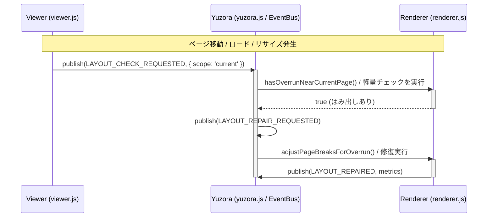

# [FEATURE] ページ移動確定後に PAGE_CHANGED イベントを発火し、イベント駆動による共通レイアウト診断・自己修復をトリガーする (ID: 053)

## 1. 概要 / Summary
現在、ページ移動アニメーション（スクロール）が完了した後の処理（進捗更新、しおり保存など）は `viewer.js` の `scrollToPage()` 関数内に直接記述されており、同期的に処理されています。また、表示されるページが確定したことを伝える `YuzoraEventType.PAGE_CHANGED`（`ui:page-changed`）イベントは定義されているものの、どこからも発火されていません。

さらに、書籍ロード直後、ウィンドウリサイズ時、およびページ移動完了時に、はみ出し修復エンジン（`adjustPageBreaksForOverrun()`）をトリガーするロジックが各所に分散して直接呼び出されています。この中には、はみ出し判定（`hasOverrun`）を挟まずに直接重い修復を走らせている箇所もあります。

本バックログでは、ページ移動確定後に `PAGE_CHANGED` イベントを正しく発火させるとともに、**「レイアウトはみ出し検証の要求」および「レイアウト修復の実行」をそれぞれ専用のイベントを介して共通化・疎結合化するイベント駆動設計（EDA）**へと改善します。

---

## 2. 影響範囲と関連ファイル / Scope and Affected Files

- [ ] [src/js/modules/event.js](../../src/js/modules/event.js) — 新イベント定数（`LAYOUT_CHECK_REQUESTED`, `LAYOUT_REPAIR_REQUESTED`）の追加
- [ ] [src/js/modules/viewer.js](../../src/js/modules/viewer.js) — ページ移動完了時に `PAGE_CHANGED` を発火、およびロード・ページ移動・リサイズ時のイベント発火連携
- [ ] [src/js/modules/renderer.js](../../src/js/modules/renderer.js) — `LAYOUT_REPAIR_REQUESTED` イベントの購読と `adjustPageBreaksForOverrun()` のトリガー
- [ ] [src/js/modules/yuzora.js](../../src/js/modules/yuzora.js) — イベントチェック要求の購読とレイアウト診断ロジックの呼び出し調整（コーディネーター役）
- [ ] [docs/DSN-02-low_level_design.md](../DSN-02-low_level_design.md) — イベント駆動設計セクション（§1.4）の更新

---

## 3. 要件と技術的詳細 / Requirements & Technical Details

### 3.1 追加するイベント型
`YuzoraEventType`（`event.js`）に以下のイベントキーを追加します。
- **`LAYOUT_CHECK_REQUESTED: 'system:layout-check-requested'`** :
  レイアウト検証が必要なタイミングで発火。ペイロードに `scope` (`'current' | 'all'`) を含めます。
- **`LAYOUT_REPAIR_REQUESTED: 'system:layout-repair-requested'`** :
  検証の結果、実際にはみ出しが検出された場合に修復の実行を要求するために発火。

### 3.2 処理シーケンス

### 3.3 実装ステップの仮説
1. **`event.js` の更新**
   - イベント定数の追加と window エクスポートの確保。
2. **`yuzora.js`（コーディネーター）での購読定義**
   - `LAYOUT_CHECK_REQUESTED` を購読し、`scope` に応じて判定処理を呼び分ける。
   - `scope: 'current'` の場合は `renderer.hasOverrunNearCurrentPage()` が `true` を返したときのみ `LAYOUT_REPAIR_REQUESTED` を発火する。
   - `scope: 'all'` の場合は無条件で `LAYOUT_REPAIR_REQUESTED` を発火する（初回ロード時やリサイズ時用）。
3. **`renderer.js` での購読定義**
   - `LAYOUT_REPAIR_REQUESTED` を購読し、`adjustPageBreaksForOverrun()` を実行する。
4. **`viewer.js` での発火**
   - `scrollToPage()` 完了時に `PAGE_CHANGED` を発火。
   - `displayBook()`（ロード完了時）および `handleResize()`（リサイズ完了時）で、直接メソッドを呼ぶ代わりに `LAYOUT_CHECK_REQUESTED`（`scope: 'all'`）を発火する。
   - `PAGE_CHANGED` の購読ハンドラで `LAYOUT_CHECK_REQUESTED`（`scope: 'current'`）を発火する。

---

## 4. 完了条件 / Success Criteria (DoD)

- [ ] ページ移動完了時に `ui:page-changed` イベントが正常に発火されること。
- [ ] ロード、リサイズ、ページ移動のすべてのタイミングで、直接のメソッド呼び出しではなく `LAYOUT_CHECK_REQUESTED` イベントを経由して検証・修復フローが起動すること。
- [ ] はみ出しがないクリーンな状態のページ移動では、`adjustPageBreaksForOverrun()` が呼び出されず、無駄な DOM 操作が発生しないこと。
- [ ] ページ移動時にはみ出しが存在する場合、診断イベントフローを経由して自動的に `adjustPageBreaksForOverrun()` が呼び出され、修復が実行されること。
- [ ] ユニットテストおよび E2E テストがすべて正常にパスすること。
- [ ] 設計書（DSN-02）の「イベント駆動アーキテクチャ」セクションに本イベント定義およびフローが反映されていること。
