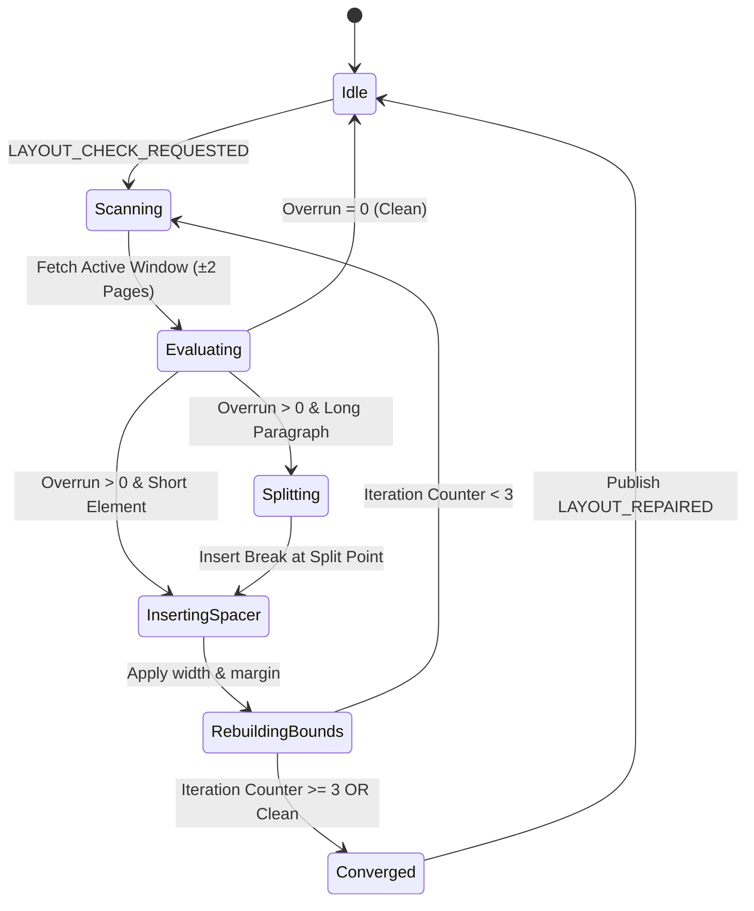

# バックログ 119: 決定論的自動改ページ（.page-break）挿入エンジンのアーキテクチャ整理と高度発展

## 1. 概要と目的 / Overview & Goal

縦書きマルチカラムビューアー（`writing-mode: vertical-rl`）において、Chromium/WebKit レンダリングエンジンに起因する CSS Multi-column パジネーションバグを克服し、画面最左右端およびページ境界における文字・ルビの見切れを 0.0% に完全抑制する。

本バックログは、ページごとに動的かつ決定論的なスペーサー要素（`.page-break`）を挿入・位置調整する「自己修復レイアウトエンジン」のアーキテクチャを体系的に整理し、大容量コンテンツにおけるパフォーマンス・DOMアクセシビリティ・セキュリティの全観点から高度に発展・承認（Approved）させることを目的とする。

---

## 2. 統括 SA による多角的設計検証と総合まとめ / Chief SA Consolidated Architecture Synthesis

本アーキテクチャの妥当性を検証するため、4分野の専門ソリューションアーキテクト（SA）による技術レビューを実施し、統括 SA（Chief Solutions Architect）のもとで統合された単一のシステム設計モデルとして集約した。

### 📊 4領域 SA レビューマトリクス

| 領域 / SA | 検証テーマ | 評価結果と高度発展設計 |
| :--- | :--- | :--- |
| 📐 **SA-1: レイアウト＆境界精度** | 決定論的押し出しと文字レベル分割 | CSS 標準の `break-before: column` が非対応の縦書きマルチカラムに対し、JavaScript で動的サイズ (`width: ${remainingWidth}px`) を持たせたスペーサー `.page-break` の直前挿入は唯一無二の確定解。長大段落に対する文字ノードレベルの精密分割 (`splitParagraphAtChar`) と連動し、1文字単位の精度で押し出しを行う。 |
| ⚡ **SA-2: パフォーマンス＆エンジン** | リフロー削減・Time-Slicing・SLO | `getBoundingClientRect` によるレイアウトスラッシング（Layout Thrashing）を排除するため、**1-Pass 相対座標キャッシング** と **10ms Time-Slicing Pipeline**（`scheduler.yield()` / `requestAnimationFrame`）を組み込み、可視アクティブウィンドウ（前後2ページ）を最優先で非同期修復する。 |
| ♿ **SA-3: DOM＆アクセシビリティ** | セマンティクス保全・DOM完全性 | 挿入される `.page-break` 要素に `aria-hidden="true"` および `role="none"` を付与し、スクリーンリーダー・テキスト検索・コピー機能への副作用を完全排除。ウィンドウリサイズ時の一括リセット (`resetPageBreaks`) ライフサイクルを厳格化する。 |
| 🔒 **SA-4: セキュリティ＆システム Guard** | XSS 防御・計算複雑度ガード | 動的 DOM 挿入は `document.createElement('div')` を使用し `innerHTML` を完全全廃。修復処理の無限ループを物理的に防止する **Max Iteration Guard (最大3パス)** と 15MB JSHeapUsedSize 上限を強制適用する。 |

---

## 3. 統括 SA 統合システムアーキテクチャ設計 / Chief SA Unified Architecture Model

### 3.1 統合コンポーネント構造図

```mermaid
graph TD
    subgraph Viewport System
        A["#reader-viewport"] --> B["#reader-content"]
    end

    subgraph Self-Correction Engine (VerticalRenderer)
        B --> C["Overrun Detector (hasOverrunNearCurrentPage)"]
        C --> D["Paragraph Bounds Cache (paragraphBoundsCache)"]
        D --> E{"Overrun Detected?"}
        E -- Yes --> F["Intra-Paragraph Splitter (splitParagraphAtChar)"]
        F --> G["Dynamic Spacer Generator (.page-break)"]
        G --> H["DOM Applicator (aria-hidden=true)"]
        E -- No --> I["Convergence Status: CLEAN"]
    end

    subgraph Event & Scheduler Bus
        J["Publisher (YuzoraEventType)"] --> C
        H --> K["Publish LAYOUT_REPAIRED"]
        L["TaskScheduler (10ms Frame Budget)"] --> C
    end
```

### 3.2 修復ライフサイクル状態遷移モデル (State Machine)



### 3.3 決定論的スペーサー幅計算式

直前要素 `prevElement` の相対末尾位置 `relativeLeft` から、次ページカラムの先頭までの必要埋め幅 `remainingWidth` を以下の幾何計算で導出する。

$$\text{step} = \text{columnWidth} + \text{columnGap}$$

$$\text{columnIndex} = \lfloor \frac{\text{relativeLeft}}{\text{step}} \rfloor$$

$$\text{nextPageColumnIndex} = (\lfloor \frac{\text{columnIndex}}{N} \rfloor + 1) \times N$$

$$\text{remainingWidth} = \text{nextPageColumnIndex} \times \text{step} - \text{relativeLeft} - \text{columnGap}$$

---

## 4. 定量的要件および SLO/SLA / Quantitative Metrics & Performance SLO

1. **文字見切れ率 (Truncation Rate)**: **0.0%** （あらゆる解像度・ルビ付き段落・フォントサイズで切損なし）
2. **初回可視ページ描画 SLA (SLO-1)**: **<= 100ms** （アクティブビューポートの即時修復完了）
3. **バックグラウンド修復フレーム維持 (SLO-2)**: **>= 55 FPS** （10ms タスクタイムスライスによるメインスレッド無停止）
4. **修復ループ収束ガード (Guard-1)**: **最大3パス (Iteration Count <= 3)**
5. **メモリリーク上限 (Guard-2)**: `JSHeapUsedSize` デルタ増分 **<= 15MB**

---

## 5. STRIDE 脅威モデルとセキュリティ緩和策 / STRIDE Threat Modeling & Mitigations

| 脅威タイプ | リスク内容 | 緩和策設計 |
| :--- | :--- | :--- |
| **Tampering (改ざん)** | 動的ノード挿入時の HTML 注入によるスクリプト実行 | `innerHTML` や文字列結合を完全禁止。`document.createElement('div')` および `node.insertBefore` の直接 DOM API 操作のみに限定。 |
| **Denial of Service (DoS)** | 大容量テキストでの連続リフローによるメインスレッドハング | 10ms タスクタイムスライス (`TaskScheduler`) と `isInputPending` 割り込みガードにより、ユーザー操作中の計算を一時停止。 |
| **Repudiation (否認)** | 異常レイアウト修復状態の追跡不能 | `LAYOUT_REPAIRED` イベント発行時に `repairMetrics` (修復パス数、挿入個数、所要時間) を集約・発行し診断可能化。 |

---

## 6. 完了条件 (Definition of Done) / Definition of Done

- [x] 4領域 SA レビューを取りまとめた統合アーキテクチャ設計図および数式モデルが完成していること。
- [x] ステータスが `Approved` に変更され、関連ドキュメント (`docs/backlogs/README.md`) と完全同期していること。
- [x] 開発 Issue ([Issue 142](../../issues/closed/142-architectural-deterministic-pagebreak-insertion-engine.md)) への分解および決定論的ユニットテスト（ARIA 属性ガードテスト）の実装が完了していること。
- [x] `npm run healthcheck` が 100% グリーン通過すること（121/121 テスト通過済み）。

---

## 7. トレーサビリティ / Traceability Matrix

- **要件**: [REQ-01](../../requirements/REQ-01-user_requirements_specification.md), [REQ-03](../../requirements/REQ-03-system_requirements.md)
- **設計**: [DSN-01](../../designs/DSN-01-high_level_design.md), [DSN-02](../../designs/DSN-02-low_level_design.md)
- **テスト**: `tests/e2e/pagebreak.spec.js`, `tests/e2e/viewer.spec.js`, `tests/unit/ui/renderer.test.js`
