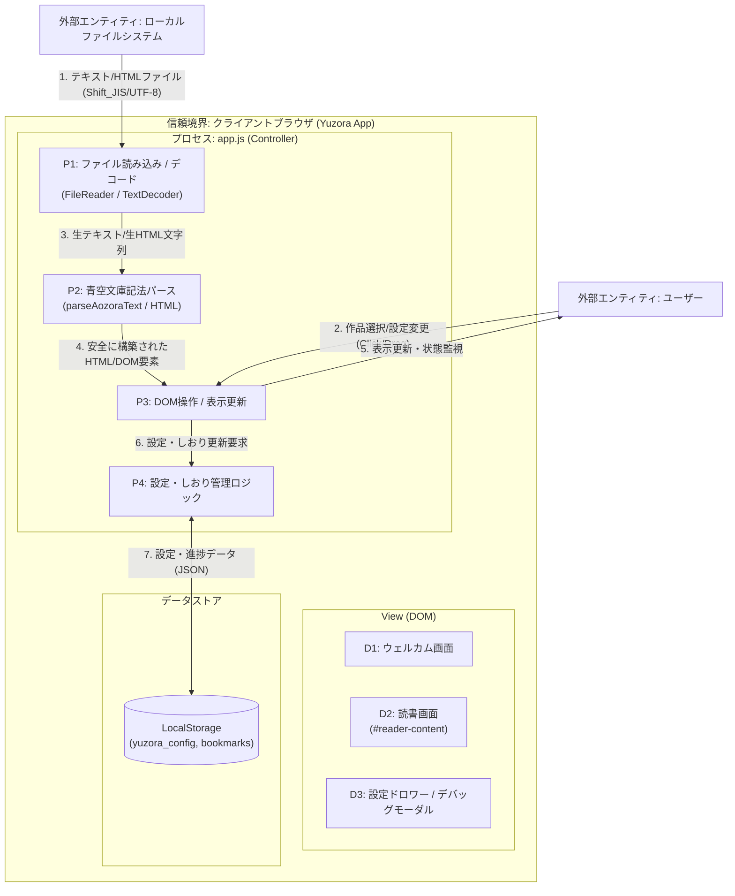

# ゆうぞら (Yuzora) - 包括的脅威モデリング結果 (STRIDE Analysis)

本ドキュメントは、セキュリティ・バイ・デザインの原則に基づき、青空文庫縦書きビューアー「ゆうぞら (Yuzora)」プロジェクト全体に対して実施した包括的な「STRIDE脅威モデリング」の結果を記録したものです。

---

## 1. システムデータフローダイアグラム (DFD)

ゆうぞらにおけるデータの流れと信頼境界（Trust Boundary）は、以下の図の通りです。

---

## 2. STRIDE脅威分析結果シート (Threat Analysis Sheet)

現在のゆうぞらシステムにおいて識別されている脅威、想定される影響、および実装されているセキュリティ緩和策の一覧です。

| 脅威ID | 脅威分類 (STRIDE) | 関連要素 (DFD) | 脅威シナリオ（具体的な攻撃・事象） | 影響度 | 現在のセキュリティ緩和策（実装） | 今後の推奨対策 | ステータス | 対応するIssue |
| :--- | :--- | :--- | :--- | :--- | :--- | :--- | :--- | :--- |
| **T-S1** | **Spoofing** (なりすまし) | P1, P3, D1 | 攻撃者が悪意ある事前定義作品のパスを改ざんし、外部の偽の書籍データをフェッチさせ、表示を偽装する。 | Low | ・`PREDEFINED_BOOKS` のフェッチパスはローカルの静的リソース（`src/books/`）にハードコードされており、外部ドメインからの取得を許可しない設計。 | ・作品リスト of パスが固定値から変更されないことを、ビルド/テスト時に検証する。 | Mitigated | - |
| **T-T1** | **Tampering** (改ざん) | P4, LocalStorage | ブラウザの `LocalStorage` にあるしおりデータや設定オブジェクトを直接改ざんし、ロード時に例外を発生させてアプリをクラッシュさせる。 | Medium | ・LocalStorageからの読み込み時に `try-catch` 処理を施し、パース失敗時はデフォルトの設定（フォントサイズ・テーマ等）へフォールバックするロジックを実装。 | ・しおりデータの数値パラメータ（進捗率: 0.0〜1.0）の範囲外エラーチェックを強化する。 | Mitigated | - |
| **T-T2** | **Tampering** (改ざん) | P4, LocalStorage, P3 | `LocalStorage` の設定オブジェクト値に不正な文字列（悪意あるCSSクラス名等）を注入され、描画時にレイアウトを改ざんされる。 | Low | ・読み込んだ設定値は、定義済みのテーマ（sepia/light/dark/black）などのホワイトリストに合致しているか検証し、適合しない値は適用を拒否する。 | ・ホワイトリスト検証処理をすべての設定パラメータに対して網羅する。 | Mitigated | - |
| **T-R1** | **Repudiation** (否認) | P3, User | 表示ズレやしおり保存の不具合が発生した際、サーバーが存在しないため動作ログがなく、不具合の事実や原因究明を否認される。 | Low | ・デバッグモーダル内に「レイアウト/見切れ診断機能」を実装し、ユーザー自身が診断を実行してMarkdown形式の診断結果レポートをバグ報告時に添付できる仕組み提供。 | ・エラー発生時に、ローカル状態スタックを一時的にダンプ・出力するヘルプ機能を追加する。 | Mitigated | - |
| **T-I1** | **Information Disclosure** (情報漏洩) | ClientApp, Storage | 読み込んだ本の内容、しおりの進捗履歴、およびユーザーの設定情報が、悪意あるスクリプト等を介して外部サーバーにアクセス・送信される。 | High | ・Content Security Policy (CSP) を導入し、外部へのコネクション（`connect-src 'self'`）や不要なリソース取得を制限。([Issue 007](../issues/closed/007-enforce-csp-mitigation-t-i1.md) にて修正済) | ・自動レビュー（review-diff-code）において、CSP設定が除去されないことを静的チェック。 | Resolved | [Issue 007](../issues/closed/007-enforce-csp-mitigation-t-i1.md) |
| **T-D1** | **Denial of Service** (サービス拒否) | P1, P2 | 数十MBを超える極めて巨大なテキスト/HTMLファイルをドロップされ、デコード・パース処理でブラウザのメインスレッドをフリーズさせる。 | Medium | ・（未実装）ファイル入力時にサイズ検証を行い、一定上限値（例: 2MB）を超える場合はエラーを表示して処理を即座に中断するサイズチェックを追加予定。 | ・ファイルインプットイベント時のサイズチェック処理（DoDに含める）の実装。 | Open | - |
| **T-E1** | **Elevation of Privilege** (権限昇格) | P2, P3, D2 | プレーンテキストファイル（.txt）の本文内に埋め込まれた `<script>` などのタグがエスケープされずにDOM描画され、XSSを実行される。 | High | ・`parseAozoraText` 内の文字列処理の最優先ステップとして、`&` -> `&amp;`, `<` -> `&lt;`, `>` -> `&gt;` のHTML特殊文字一括エスケープを強制実施。([Issue 005](../issues/closed/005-fix-xss-vulnerability-t-e1.md) にて修正済) | ・自動レビュー（review-diff-code）において、エスケープ漏れが混入しないことを静的チェック。 | Resolved | [Issue 005](../issues/closed/005-fix-xss-vulnerability-t-e1.md) |
| **T-E2** | **Elevation of Privilege** (権限昇格) | P2, P3, D2 | HTML形式（.html/.xhtml）のファイルを読み込んだ際、本文内に埋め込まれた悪意あるスクリプトが実行される（XSS）。 | High | ・`DOMParser` を経由してパース後、ホワイトリスト方式で安全なHTMLタグおよび属性のみを許可するサニタイズ処理（`sanitizeDOM`）を実施。([Issue 006](../issues/closed/006-fix-xss-vulnerability-t-e2.md) にて修正済) | ・自動レビュー（review-diff-code）において、サニタイズ処理のバイパスが混入しないことを静的チェック。 | Resolved | [Issue 006](../issues/closed/006-fix-xss-vulnerability-t-e2.md) |

